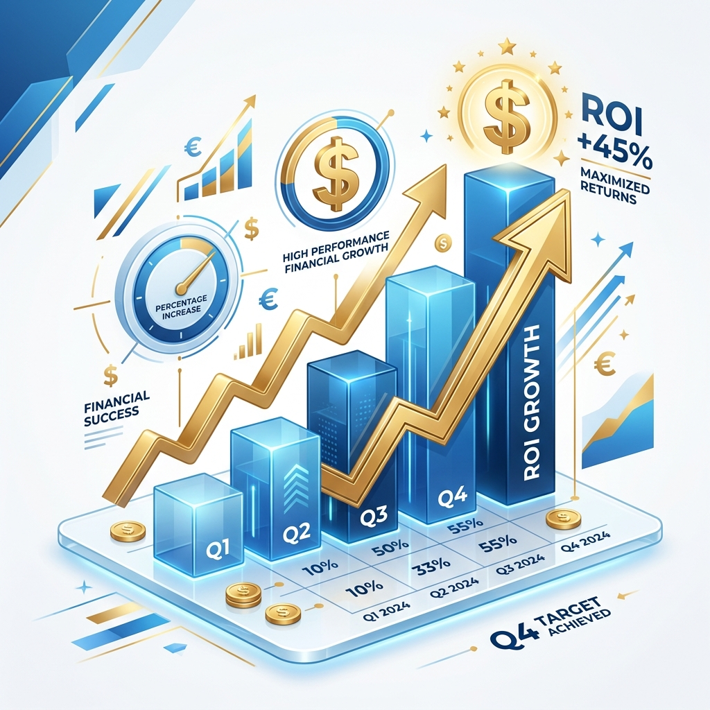

# 倉儲方案完整對話整理

## 主題
比較重型貨架（Selective Racking）、後推式貨架（Push-Back Racking）、防爆自動倉儲（Explosion-proof AS/RS）及混合式方案。

## 建置成本（每板位）
| 系統 | 每板位成本 |
|---|---:|
| 重型貨架 | NT$3,800～5,500 |
| Push Back | NT$7,500～11,500 |
| 防爆 AS/RS | NT$45,000～120,000 |

Push Back 約為重型貨架 2 倍；防爆 AS/RS 約為重型貨架 5～15 倍。

## 建置總價（估算）

| 板位 | 重型貨架 | Push Back | 防爆 AS/RS |
|---:|---:|---:|---:|
|1000|450萬|950萬|5,000～8,000萬|
|1500|675萬|1,425萬|7,000萬～1.1億|
|2000|900萬|1,900萬|9,000萬～1.5億|

## 空間利用率
- 重型貨架：約35～40%
- Push Back：約55～70%
- 防爆 AS/RS：約80～95%

## 維護成本
- 重型貨架：0.5～1%／年
- Push Back：1.5～3%／年
- 防爆 AS/RS：3～6%／年

## 混合式方案
A區：防爆AS/RS（高危險、高周轉）
B區：Push Back（同SKU大量）
C區：重型貨架（多SKU、備品）

優點：
- 投資低於全自動倉
- 保留高周轉區自動化
- 易於分階段擴充

## ROI
- Push Back：約3～5年（視外租倉節省而定）
- 防爆AS/RS：約6～12年（視人工、土地、效率改善而定）

## 建議招標項目
- Layout規劃
- 3D模擬
- 防爆設計
- 消防整合
- WMS/WCS/ERP整合
- 20年TCO分析
- ROI分析
- 維護保養方案
- 擴充性

## 建議評估廠商
### 自動倉儲
- 廣運機械工程
- 鴻匠科技

### 貨架
- 宏諾
- 台倉
- 必拓國際

## 後續知識庫建議
建立完整Markdown資料庫，納入TCO、ROI、案例、RFP、評選標準等內容。

