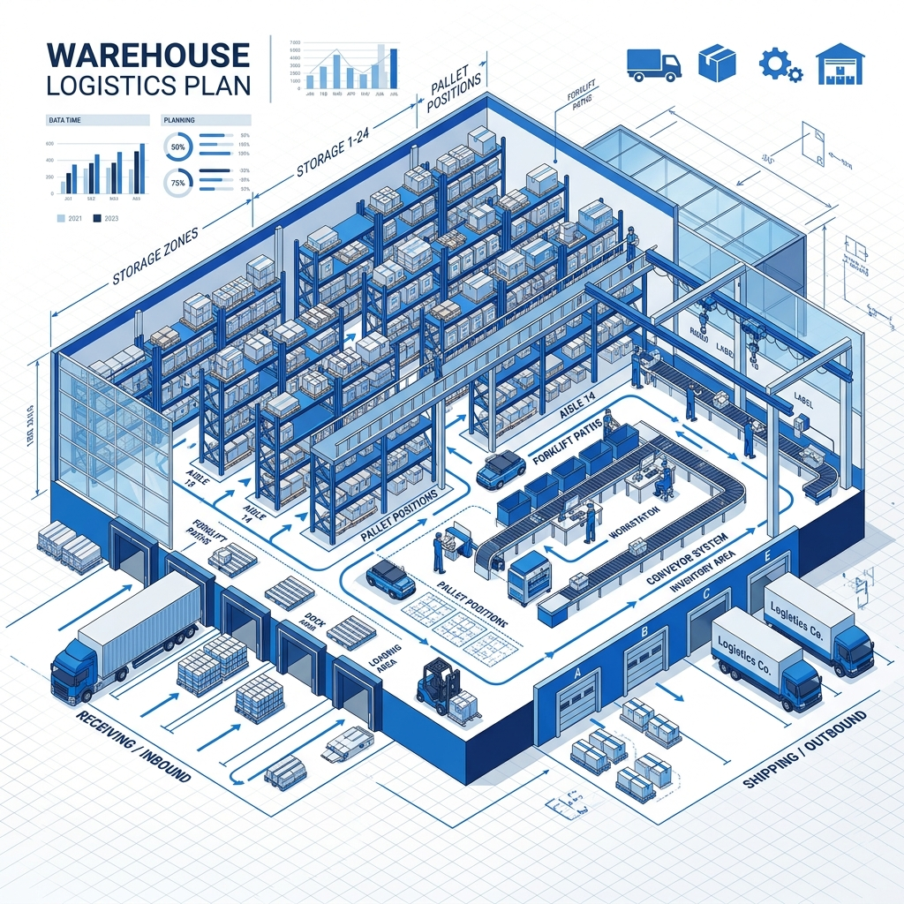
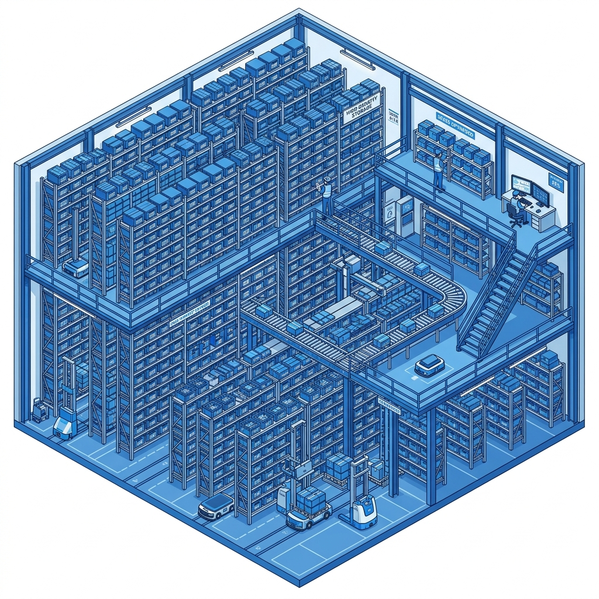
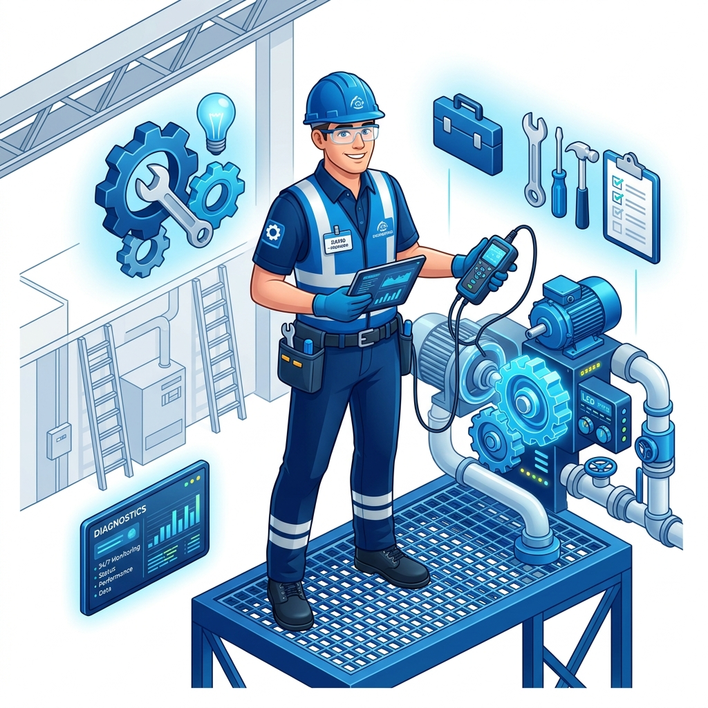
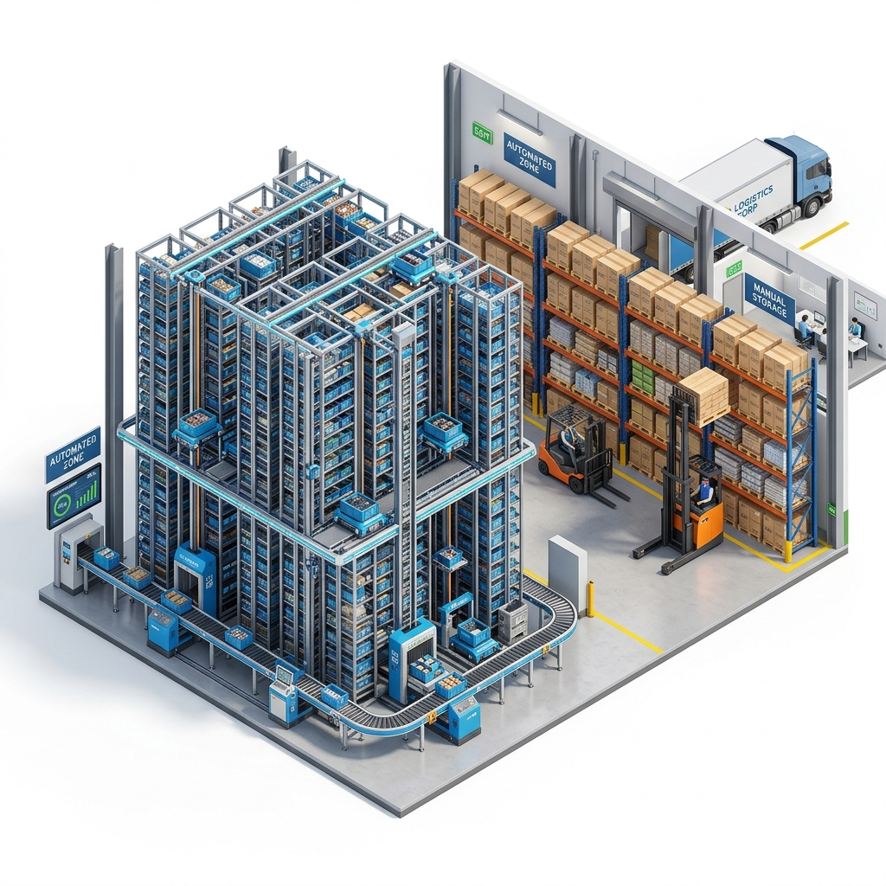
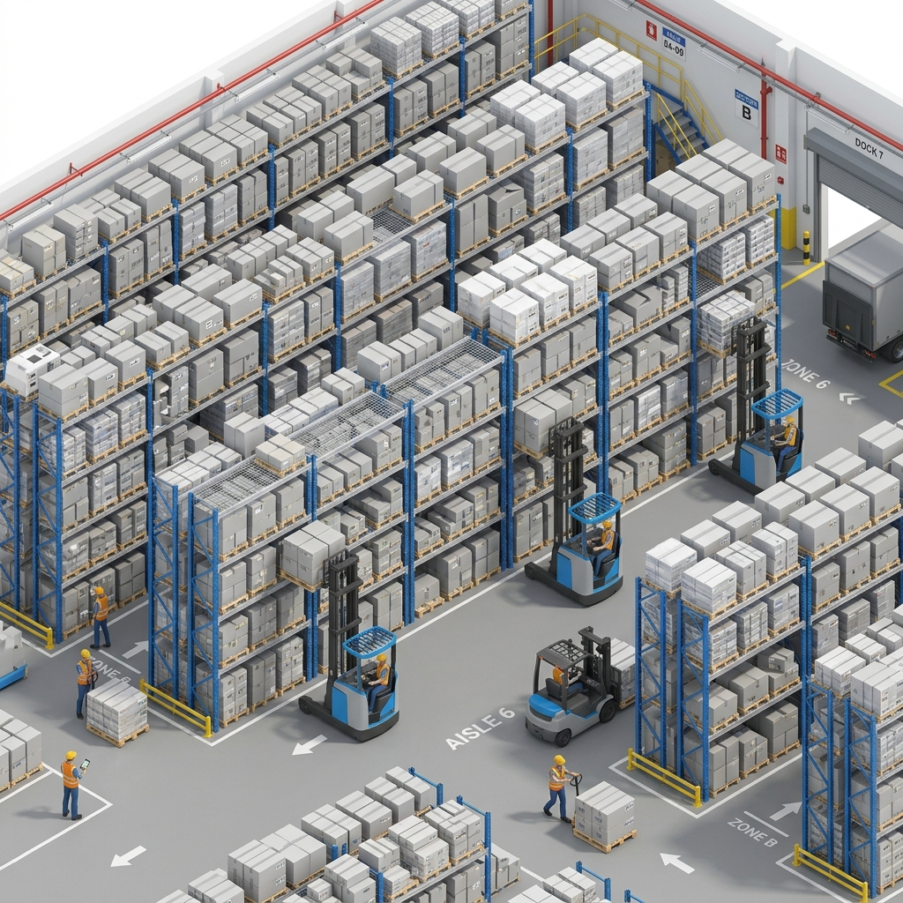
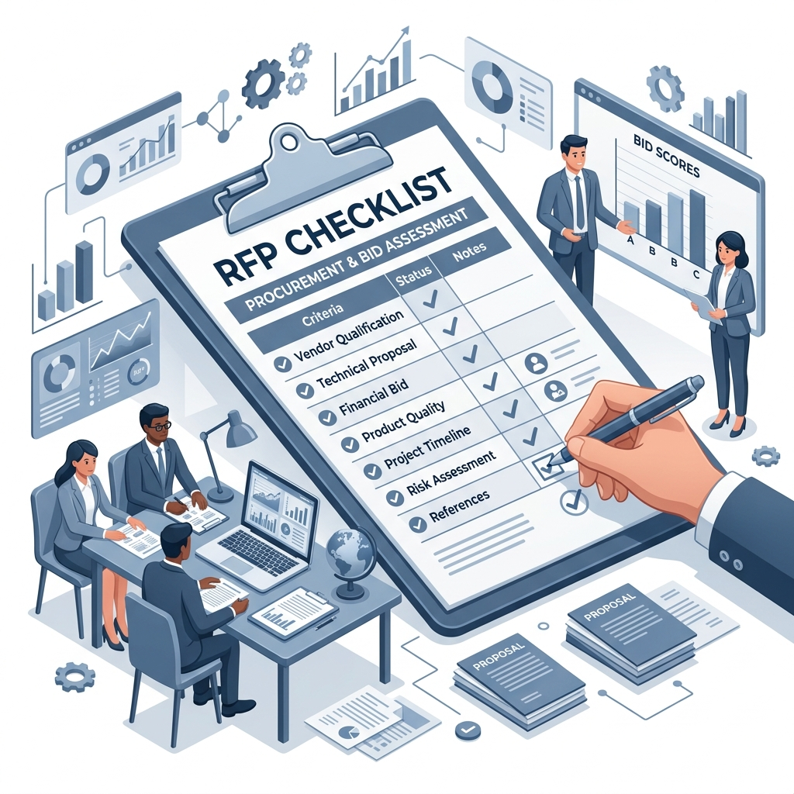

# 倉儲方案比較筆記

## 比較方案

1.  重型貨架（Selective Racking）
2.  後推式貨架（Push-Back Racking）
3.  防爆自動倉儲（Explosion-proof AS/RS）
4.  混合式方案（Hybrid）

## 每板位建置成本（估算）

  系統                       每板位
  ----------- ---------------------
  重型貨架         NT\$3,800--5,500
  Push Back       NT\$7,500--11,500
  防爆AS/RS     NT\$45,000--120,000

## 建置總價（估算）

    板位    重型   Push Back        防爆AS/RS
  ------ ------- ----------- ----------------
    1000   450萬       950萬   5,000--8,000萬
    1500   675萬     1,425萬   7,000萬--1.1億
    2000   900萬     1,900萬   9,000萬--1.5億

## 空間利用率

-   重型：約35--40%
-   Push Back：約55--70%
-   防爆AS/RS：約80--95%

## 維護成本

-   重型：建置費0.5--1%/年
-   Push Back：建置費1.5--3%/年
-   防爆AS/RS：建置費3--6%/年

## 混合式方案

-   高周轉、高危險品：防爆AS/RS
-   同SKU大量：Push Back
-   多SKU、低周轉：重型貨架

## 台灣可評估廠商

### 自動倉儲整合

-   廣運機械工程
-   鴻匠科技

### 貨架

-   宏諾
-   台倉
-   必拓國際

## 建議招標比較

-   建置成本
-   20年維護成本
-   空間利用率
-   ROI
-   WMS/ERP整合
-   防爆與消防設計
-   擴充性

