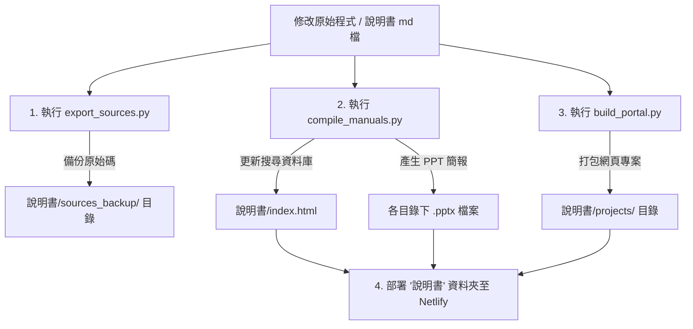

# 專案大廳維護工具箱 (portal_tools) - 操作說明書

> 🔗 **GitHub 專案庫**：[shihwei0809/google-agent](https://github.com/shihwei0809/google-agent)
> 📁 **工具箱本機路徑**：[portal_tools/](file:///D:/GOOGLE%20ANGET/portal_tools)

## 專案簡介
本工具箱包含四個關鍵的自動化維護工具，專為 **GOOGLE ANGET** 專案大廳設計。旨在透過自動化流程，解決「程式更新後說明書未同步」、「網頁大廳搜尋快取過期」及「手動製作 PPT 簡報費時」等維護痛點，實現「程式即文檔」的無縫自動化管理。

---

## 🛠️ 核心工具功能介紹

### 1. 📥 源碼自動備份工具 (`export_sources.py`)
- **用途**：將分散在各專案資料夾的核心原始碼自動備份並包裝成 Markdown 檔案，放置於 `說明書/sources_backup/` 中。
- **好處**：AI 協同助理（如 Antigravity）只需讀取此單一備份目錄，即可在 1 秒內載入您所有核心專案的程式全貌，無需解析龐大的專案結構（如 Android build 或 Python venv 檔案）。
- **備份項目**：
  - N系列BARCODE出貨核對 (GAS `Code.gs`, `Index.html`, `Query.html`)
  - n系列GAS轉APK (Kotlin `MainActivity.kt`, `NetworkHelper.kt`)
  - 溫度通報系統 (Python `weather_monitor.py`, `config.json`, GAS `Code.gs`)

### 2. ⚙️ 說明書資料庫編譯器 (`compile_manuals.py`)
- **用途**：自動掃描三大類別資料夾下的所有 Markdown 說明書檔案，將其標題、路徑與內容轉換為 JSON 格式，並注入到 `說明書/index.html` 網頁中的 `const manualsData` 變數中。
- **好處**：更新說明書後，網頁大廳的**即時搜尋框與全文檢索資料庫會自動更新**，無需手動複製 JSON，杜絕特殊符號轉義錯誤（Escape errors）。

### 3. 📦 靜態大廳打包工具 (`build_portal.py`)
- **用途**：將具備純前端網頁展示性質的核心專案（如 flowchart-web、hongsheng-web 等）複製並打包至 `說明書/projects/` 底下。
- **好處**：自動將網頁中的「回大廳」相對路徑修正為 `./projects/` 相應路徑，以便一鍵部署至雲端託管空間（如 Netlify）。

### 4. 📊 說明書簡報產生器 (`generate_all_pptx.py`)
- **用途**：讀取所有 Markdown 說明書，自動解析其中的簡介、特色、技術棧、操作步驟，並套用專屬暗色科技風格主題，自動產生對應的 `[說明書名稱].pptx` 簡報。
- **好處**：提供自動化生成教育訓練簡報與主管匯報投影片的能力。

---

## 🔄 自動化同步流程圖



---

## 💻 本機執行與操作步驟

### 📋 系統環境需求
本工具箱使用 **Python 3.x** 執行，部分腳本需要安裝第三方套件：
```powershell
pip install python-pptx
```

### 🚀 執行命令
在終端機（CMD 或 PowerShell）中進入 `portal_tools` 資料夾，依序或選擇性執行腳本：

```powershell
# 1. 進入維護資料夾
cd "D:\GOOGLE ANGET\portal_tools"

# 2. 自動備份關鍵原始碼
python export_sources.py

# 3. 編譯說明書網頁資料庫並更新 PPT 簡報
python compile_manuals.py

# 4. 打包靜態網頁專案
python build_portal.py
```

---

## ⚠️ 注意事項
1. **防脫節協定**：每次有更新 GAS、Android App 或 Python 監控程式碼時，**請務必執行 `export_sources.py`** 重新產生原始碼備份，確保 AI 助手後續排查時讀取的是最新版本。
2. **編碼規格**：所有 Markdown 說明書檔案必須存成 `UTF-8` 編碼，以防止編譯至 `index.html` 時出現亂碼。
