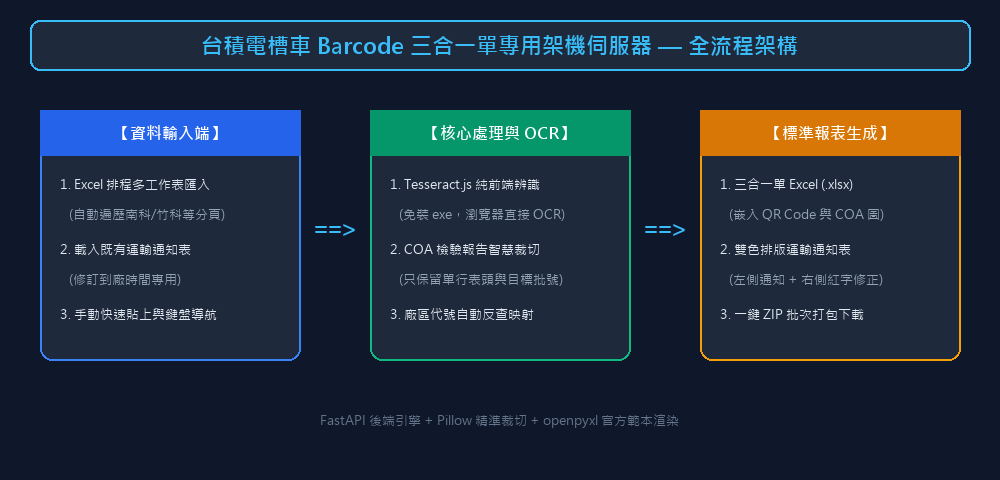
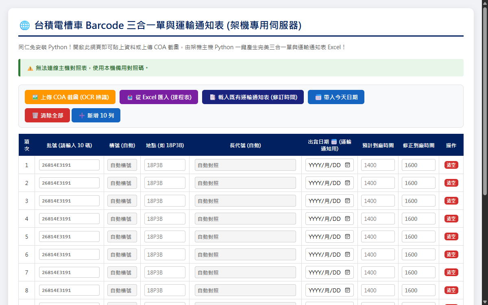
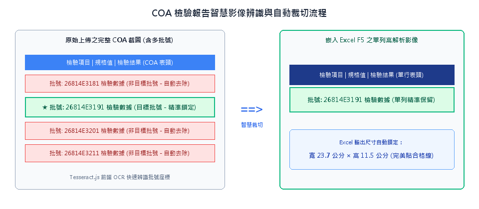
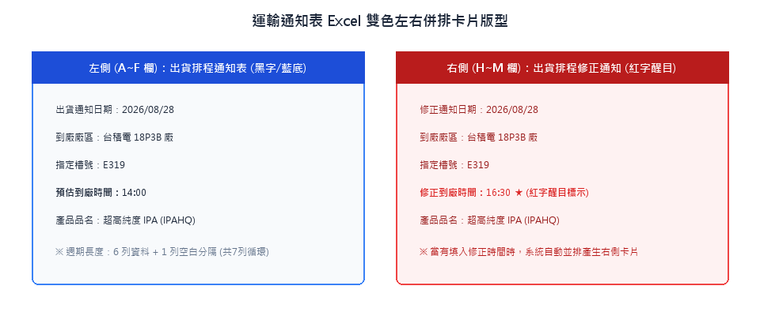

# 三合一單網頁架機伺服器 — 操作說明書

> 【系統定位】台積電槽車 Barcode 三合一單與運輸通知表專用架機伺服器  
> 【GitHub 專案庫】https://github.com/shihwei0809/google-agent/tree/main/三合一單網頁架機伺服器  
> 【專案類別】第二類 生產管理與 API 串接 / 台積電槽車專用三合一單系統  

---

## 【一、系統簡介】

本系統為鴻勝化學專屬之「台積電槽車 Barcode 三合一單與運輸通知表」單網頁架機伺服器（Web SPA），專為解決廠區現場多台電腦、平板或手機協同架機作業而設計。透過本機 FastAPI 後端與前端直覺介面，現場人員可透過瀏覽器快速匯入排程、上傳 COA 截圖進行智慧辨識裁切、修改到廠時間，並一鍵批量生成符合台積電驗收標準的三合一單（含 QR Code 及高解析 COA 嵌入）與雙色排版之運輸通知表。



---

## 【二、核心功能特色】

1. 純前端 AI OCR 影像辨識 (Tesseract.js)：
   - 解決內網限制無法安裝 .exe 的痛點，直接在瀏覽器端辨識 COA 檢驗報告截圖。
   - 智慧裁切出【單行表頭 + 指定 10 碼批號數據列】，其餘多餘批號列自動去除。
   - 嵌入 Excel F5 儲存格時自動鎖定最佳尺寸：寬 23.7 公分 × 高 11.5 公分。

2. 多分頁智慧 Excel 排程匯入：
   - 自動遍歷工作簿內所有分頁（如 IPAHQ(TANK)-南科、竹科等）。
   - 支援「到貨」、「到貨日」、「出貨日期」等全格式日期辨識。
   - 支援「優先抓今天~後天 (3天)」、「今天」、「明天」等快捷篩選，完全過濾非指定日期排程。

3. 載入既有運輸通知表 (修訂到廠時間)：
   - 支援一鍵選取當天已產生的 運輸通知表.xlsx。
   - 採用絕對儲存格座標解析，秒級還原第 1 ~ N 列的排程卡片（日期、地點、槽號、時間）。
   - 人員只需在紅字欄位填寫【修正到廠時間】，系統自動於右側（H~M 欄）併排產出「出貨排程修正通知」紅字卡片。

4. Excel 級鍵盤流暢導航：
   - 支援鍵盤「上、下、左、右」方向鍵與「Enter」鍵在輸入格間快速移動與自動反白，大幅提升連續輸入效率。
   - 在最後一列按方向鍵向下時，系統會自動在底部追加 5 列空白列。

5. 區域網路自動廣播與 Port 佔用自動切換 (Port Fallback)：
   - 自動偵測 8002 埠號，若被佔用則順延至下一個可用 Port（如 8003, 8004）。
   - 終端主控台即時顯示本機區域網路 IP，方便同仁在廠區內網連線使用。

---

## 【三、系統目錄結構】

```text
C:\GOOGLE ANGET\第二類_生產管理與API串接\三合一單網頁架機伺服器\
|-- static/
|   `-- index.html                          [前端單頁應用程式：UI / SheetJS / Tesseract.js / QR]
|-- server.py                               [FastAPI 後端伺服器：openpyxl 產單引擎 / Pillow 裁切]
|-- 架設伺服器_一鍵啟動.bat                  [現場一鍵自動偵測環境並啟動瀏覽器]
|-- 台積電槽車barcode三合一單-範本.xlsx      [台積電官方標準 Excel 樣板]
|-- 地點代號對照表.xlsx                      [台積電各廠區代號對照表，如 18P3B -> EF180183B]
|-- 運輸通知表.xlsx                          [運輸通知表備用範本]
|-- images/                                 [操作說明書真實畫面截圖與示意圖]
|-- 三合一單網頁架機伺服器_操作說明書.docx    [Word 版操作說明書 (含真實截圖)]
|-- 三合一單網頁架機伺服器_操作說明書.pdf     [PDF 版操作說明書 (含真實截圖)]
|-- README.md                               [專案說明與開發規範]
|-- SKILL.md                                [AI 助理維護說明書]
|-- setup_env.ps1                           [一鍵環境安裝腳本]
`-- 操作說明書.md                            [本操作手冊]
```

---

## 【四、現場標準操作步驟】

### 步驟一：一鍵啟動伺服器
1. 進入目錄 `C:\GOOGLE ANGET\三合一單網頁架機伺服器\`。
2. 雙擊執行 **`架設伺服器_一鍵啟動.bat`**。
3. 黑色主控台視窗會自動檢測 Python 套件，並在瀏覽器自動開啟 **`http://localhost:8002`**。
4. （選用）若同仁需透過區網連線，可將主控台上顯示之本機 IP 網址（例如 `http://192.168.1.100:8002`）分享給同仁。

---

### 步驟二：排程資料輸入（三種方式任選）



- 方式 A：從 Excel 排程表匯入（推薦）
  1. 點擊頂部紫色按鈕「**從 Excel 匯入 (排程表)**」。
  2. 選擇當天的排程 Excel 檔案。
  3. 點擊「**優先抓今天~後天 (3天)**」進行快速過濾。
  4. 預覽無誤後點擊「**確認匯入**」，資料自動填入表格。

- 方式 B：載入既有運輸通知表（修改時間專用）
  1. 點擊深藍色按鈕「**載入既有運輸通知表 (修訂時間)**」。
  2. 選取先前產出的 `運輸通知表.xlsx`，系統自動還原當天所有排程。
  3. 直接在目標列的【**修正到廠時間**】（紅字框）輸入新時間（例如 `1630`）。

- 方式 C：手動輸入 / 複製貼上
  1. 在第 1 欄輸入 10 碼批號（如 `26814E3191`），槽號會自動計算產生。
  2. 在地點欄輸入廠區簡稱（如 `18P3B`），長代號會自動反查填入。
  3. 可使用鍵盤上下左右鍵快速切換欄位。

---

### 步驟三：上傳 COA 檢驗報告截圖 (選用)
1. 點擊橘色按鈕「**上傳 COA 截圖 (OCR 辨識)**」。
2. 選擇包含 1 筆或多筆批號的 COA 報告截圖。
3. 瀏覽器端 Tesseract.js 會自動進行高精度文字識別，並將座標送至後端進行單列精準裁切。



---

### 步驟四：一鍵產生報表與下載

在頁面底部點選欲產生的報表：
- **一鍵產生所有報表 (ZIP 打包)**：一次產生所有選定項次之三合一單 Excel（含 QR Code 與 COA 截圖）以及完整的運輸通知表 Excel。
- **單獨產生三合一單 Excel**：僅產出三合一單壓縮檔。
- **單獨產生運輸通知表 Excel**：僅產出運輸通知表（若有修正時間會自動在右側 H~M 欄併排生成紅字修正卡片）。



---

## 【五、技術架構與關鍵配置】

| 模組 | 技術方案 | 關鍵設計說明 |
|---|---|---|
| 前端架構 | HTML5 + Vanilla JS (SPA) | 零前端建置流程，開啟即用 |
| 影像 OCR | Tesseract.js (CDN) | 前端純 JavaScript 辨識，不依賴本機 tesseract.exe |
| 排程解析 | SheetJS (xlsx.full.min.js) | 瀏覽器端秒級解析多工作表 Excel |
| 後端伺服器 | Python FastAPI + Uvicorn | 高併發異步伺服器，自動 Port Fallback |
| Excel 產單 | openpyxl | 保留官方樣板公式、格式、QR Code 與圖片嵌入 |
| 圖片處理 | Pillow (PIL) | 動態像素裁切與單行表頭拼接 |

---

## 【六、現場維護與避坑指南】

1. 批號長度嚴格限制 10 碼：
   - 鴻勝系統批號一律嚴格限定為 10 碼（如 `26814E3191`）。
   - 請勿與勝一三合一系統（10~11 碼）邏輯混淆。

2. 運輸通知表卡片間距：
   - 運輸通知表每張卡片高度固定為 6 列資料 + 1 列空白分隔列（週期固定為 7 列）。
   - 解析時必須依據第 1, 8, 15, 22... 列之座標進行讀取。

3. 區網連線防火牆設定：
   - 第一次在 Windows 執行批次檔時，若彈出「Windows Defender 防火牆」提示，請勾選「私人網路」並點擊「允許存取」。
