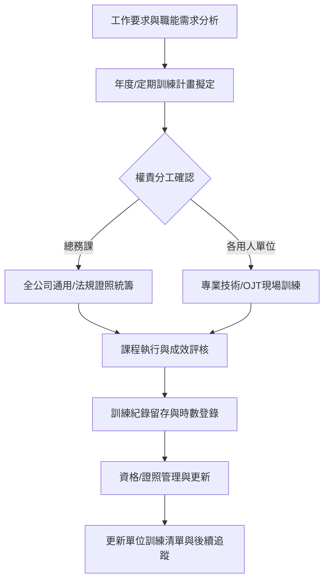

# 鴻勝化學｜教育訓練作業管理辦法（4.0版）精實教材

**文件編號**：C10200-EDU-01  
**宣導單位**：資材部  
**生效日期**：2025/04/14  

---

## 💡 教材核心重點 (Key Takeaways)

1. **職能需求導向**：所有訓練計畫必須緊扣崗位「工作要求」，杜絕形式主義，確保訓用合一。
2. **合規與資格控管**：嚴格落實「法定證照」與「內部操作資格」的定期更新與有效性追蹤，確保營運合規。
3. **閉環管理與紀錄留存**：訓練從需求、執行、考核到「單位訓練清單」更新，必須全程留下可稽核的完整紀錄。

---

## 🖼️ 系統流程圖

---

## 📖 步驟解析與講稿

### 第一章：辦法目的與適用範圍
* **目的**：建立標準化教育訓練體系，提升員工專業職能，滿足法規要求並降低工安與作業風險。
* **適用範圍**：鴻勝化學全體同仁（包含正式員工、約聘人員、新進人員及特定承攬/實習人員）。

> 🎙️ **講師講稿 (Narration)：**  
> 「各位同仁大家好，今天為大家宣導的是資材部主辦的《教育訓練作業管理辦法 4.0版》。這次改版的核心目的，是為了讓全廠各單位的技能傳承與合規管理更加標準化。本辦法適用於鴻勝化學全體夥伴，無論是新進人員、現場操作員或是管理幹部，都必須遵循這套規範進行培訓與資格認證。」

---

### 第二章：組織權責分工（總務課 vs. 各用人單位）
為落實訓練閉環，權責劃分明確：
1. **總務課（人資/主辦窗口）**：
   * 統籌全廠通識性訓練、法定證照排訓與換證追蹤。
   * 建立全廠訓練架構、管理系統與外部受訓資源審核。
2. **各用人單位（各部/課級）**：
   * 盤點各崗位專業職能與作業指導書（SOP）需求。
   * 制定內部在職訓練（OJT）計畫、指派單位內部講師。
   * 維護並更新單位的訓練與資格清單。

> 🎙️ **講師講稿 (Narration)：**  
> 「在分工上，大家常有迷思覺得『辦訓是總務課的事』。在4.0版中我們特別強調：總務課負責的是全廠架構、法規合規性與制度推進；而真正專業的技能訓練、OJT現場教學，主管與各位資深同仁才是關鍵負責人。只有各單位主管清楚崗位需要什麼能力，訓練才能落到實處。」

---

### 第三章：訓練計畫要對應工作要求
* **崗位矩陣匹配**：各單位排定訓練前，必須依據職位說明書與現場風險評估，確認「該職位必備的知識、技能與防護意識」。
* **精準規劃**：杜絕為辦而辦的無效課程，課程內容須直接對標作業缺陷預防、良率提升或安全作業規範。

> 🎙️ **講師講稿 (Narration)：**  
> 「請主管在排訓時務必檢視：這堂課對應的是哪一項作業要求？新進人員有沒有完成對應機台的SOP培訓？訓練計畫不是交差的作業，而是預防現場異常的第一道防線。」

---

### 第四章：法規證照與內部資格管理
1. **法定證照管理**：
   * 涵蓋堆高機、特定化學物質作業主管、急救人員、鍋爐操作等法定資格。
   * 證照到期前 3 個月啟動回訓預警，嚴格禁止無照/過期操作。
2. **內部操作資格認證**：
   * 針對特殊關鍵製程或高風險設備，員工需通過學術科考核後方可授予內部授權資格。

> 🎙️ **講師講稿 (Narration)：**  
> 「在化學工廠，合規是生存底線。法定證照一旦過期，就等同於無照上崗，不僅違法更伴隨巨大安全隱患。請各單位務必主動配合證照到期換發與回訓排程。」

---

### 第五章：訓練執行、考核與紀錄留存
* **簽到確認**：訓練執行當日須有完整的簽到紀錄（嚴禁代簽）。
* **考核評估**：採用筆試、實作或主管評核，評定訓練成效（需留存考卷或評分表）。
* **歸檔保存**：簽到表、教材、測驗成績及訓練紀錄表，依規定妥善保存至少 3 年以上，以備內部與外部稽核。

> 🎙️ **講師講稿 (Narration)：**  
> 「辦了訓練如果沒有紀錄，在稽核標準裡就等於『沒做』。請各位訓練承辦人與主管特別注意：簽到、測驗卷、評分表務必齊全並及時歸檔，這是落實合規管理的基本要求。」

---

### 第六章：宣導後的行動方針——落實單位訓練清單
* **課後行動重點**：宣導結束後，各單位必須即刻回到現場，檢視並更新各課別的「**年度訓練執行進度**」與「**同仁資格訓練清單**」。
* **持續跟進**：如有進度落後或新進同仁資格缺漏，應於次月排程中主動補正。

> 🎙️ **講師講稿 (Narration)：**  
> 「今天的宣導不是結束，而是行動的開始。請各位單位主管與種子種子窗口回到部門後，立即開啟你們單位的訓練清單，檢查是否有未完成受訓的同仁或即將到期的證照，確實填補缺口。感謝大家的時間與配合！」

