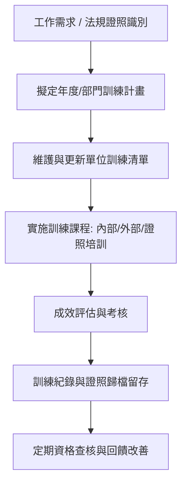

# 鴻勝化學｜教育訓練作業管理辦法 4.0 版 員工指引

---

## 💡 教材核心重點 (Key Takeaways)

1. **訓用合一與資格合規**：訓練計畫緊密對應現場崗位工作要求，並嚴格落實政府法規證照與公司內部資格的管理及展延。
2. **權責清晰與落實執行**：總務課負責統籌制度與公共訓練，各部門落實專業崗位培訓，確保每項訓練確實執行。
3. **完整留痕與持續維護**：所有訓練必須留存簽到與評核紀錄，訓練完成後應即時更新「單位訓練清單」以利後續追蹤。

---

## 🖼️ 系統流程圖

---

## 📖 步驟解析

### 第一章：辦法目的與適用對象
* **制定目的**：建立標準化教育訓練體系，提升員工專業工作技能，確保作業安全與合規性。
* **適用範圍**：全體正式員工、約聘人員及新進同仁均納入本辦法管理規範。

---

### 第二章：權責分工（總務課 vs 各單位）
為確保訓練落實，公司劃分明確職責：
* **總務課職責**：
  * 統籌全公司通識性、法規必備及全廠性教育訓練。
  * 審核各單位訓練計畫與外部證照派訓管理。
  * 建立全公司教育訓練檔案資料庫。
* **各部門／現場單位職責**：
  * 依實際工作站技能需求，編制與執行單位內部專業訓練。
  * 管理同仁的法定證照有效期限與內部上崗認證資格。
  * 確實回報受訓紀錄並維持「單位訓練清單」之最新狀態。

---

### 第三章：工作要求與法規證照管理
* **對應工作要求**：訓練主題必須對應崗位職能（SOP作業、設備操作、品質要求、安全衛生等），不做形式化培訓。
* **法規證照控管**：具法定資格要求之崗位（如堆高機、天車、急救員、環安衛等），必須持有效證照方可上崗，並由各單位定期追蹤回訓換證進度。
* **內部資格認證**：關鍵製程或特殊工作站需通過內部實務考核，確認具備合格技能後方可獨立作業。

---

### 第四章：訓練執行、成效評估與紀錄留存
1. **課前準備**：確認教材、簽到表及講師安排。
2. **課程執行**：全員確實簽到，遵守課堂秩序。
3. **成效評核**：依課程性質採筆試、實作測驗或現場問答確認學員吸收程度。
4. **紀錄留存**：簽到表、測驗成績及訓練照片須於規定期限內歸檔備查。

---

### 第五章：宣導後的後續行動
* 課程或宣導結束後，各單位主管與種子人員須立即檢視並更新**「單位訓練清單」**。
* 確實盤點尚未受訓或證照即將到期的人員，排定補訓計畫，確保全員合規。

