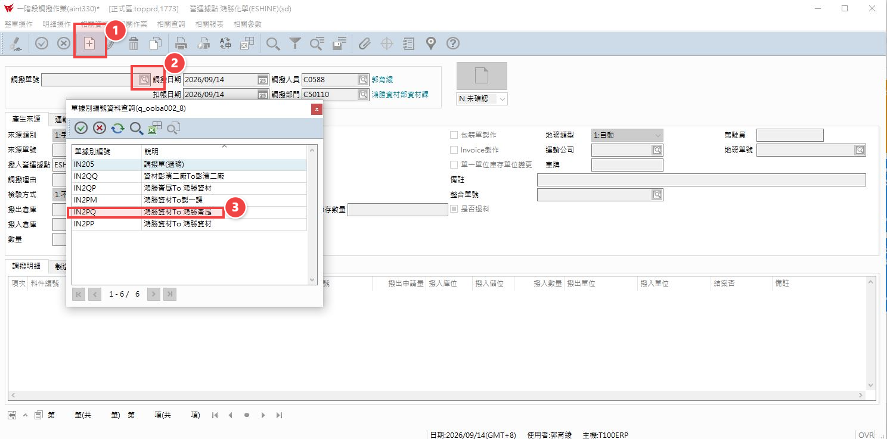
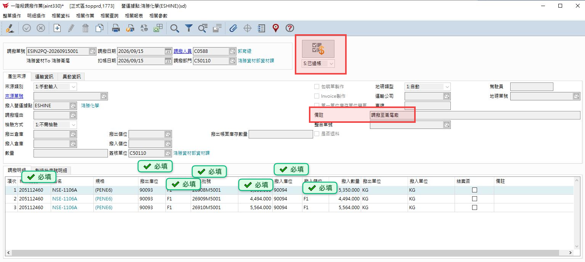
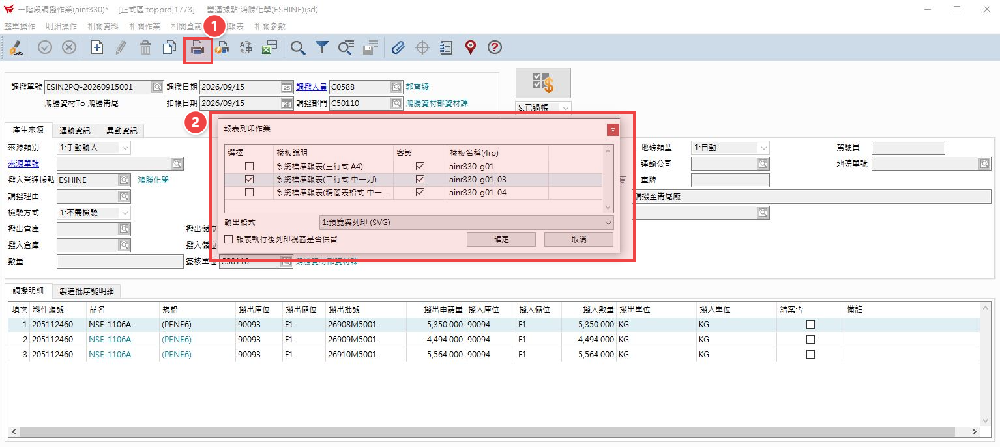

# 1.一階調撥.pptx (系統自動轉換)

## 第 1 頁

1.一階調撥 簡報大綱與核心內容整理

a.主要不用再過磅(不用登打磅單)。
b.直接用相同數量做調撥。
c.最常用在N系列包材一廠與二廠之間的調撥。

## 第 2 頁

步驟 1
•	按 + 新增 。步驟 2 .再接下拉式選擇單據別編號。步驟 3 .依照單別去選調撥的起迄點。

倉儲系統方案比較簡報 | Page 2

## 第 3 頁

依照要調撥的料號、批號、數量等調撥資料打入單身部份，如下圖打勾處KEY入，最後按過帳。

倉儲系統方案比較簡報 | Page 3

## 第 4 頁

步驟
最後按列印圖示選中一刀白色紙張再交給地磅人員

倉儲系統方案比較簡報 | Page 4

