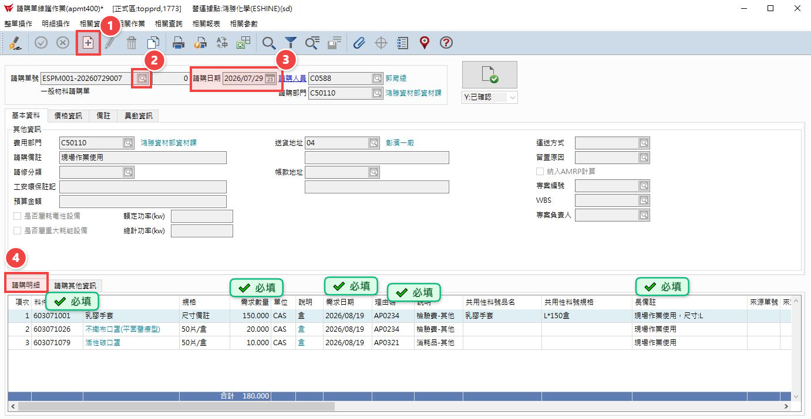
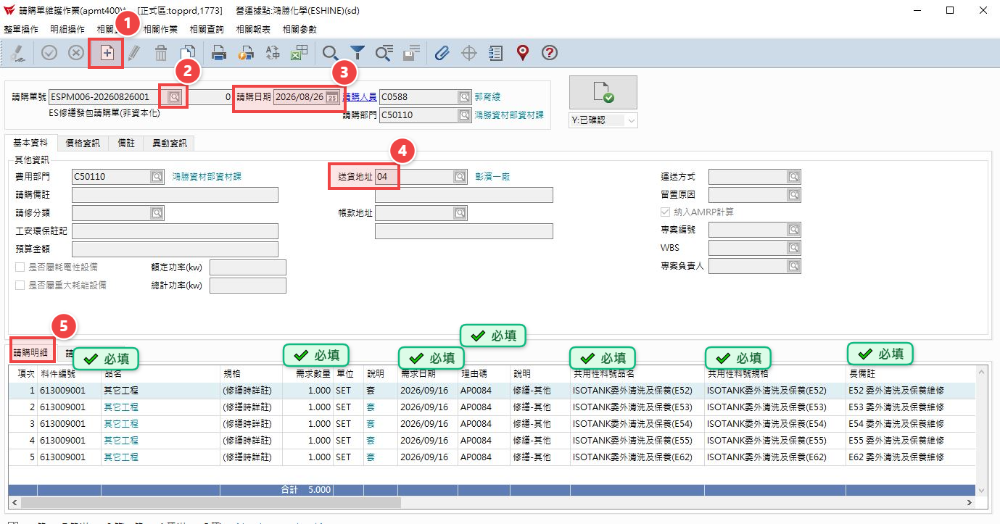
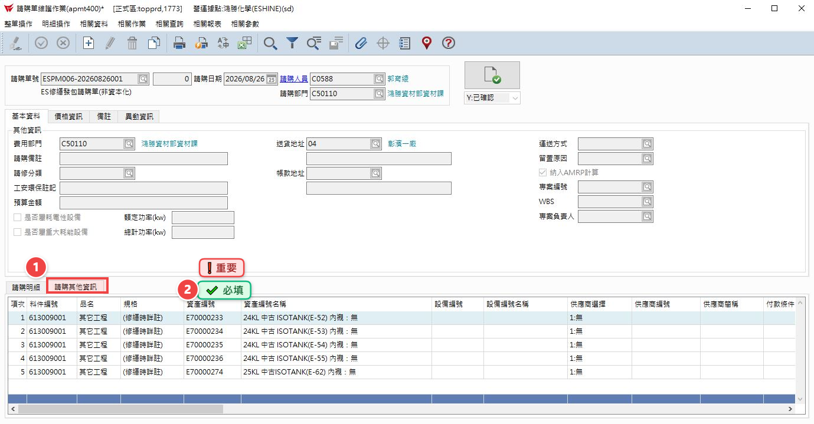

# 14.請購單維護

## 第 1 頁

14.請購單維護
簡報大綱與核心內容整理

請購單申請依申請單別作區分。此份先已一般物料請購及非資本化修繕申請做範例。

## 第 2 頁

步驟 1

一、物料請購

倉儲系統方案比較簡報 | Page 2

## 第 3 頁

步驟 2-1

二、繕繕發包申請單
依照下圖指示依序操作。若有財編的修繕要做下一頁。

## 第 4 頁

步驟 2-2

三、繕繕發包申請單
有財產編號的要再點單身的請購其他資訊填入財編。

倉儲系統方案比較簡報 | Page 3

