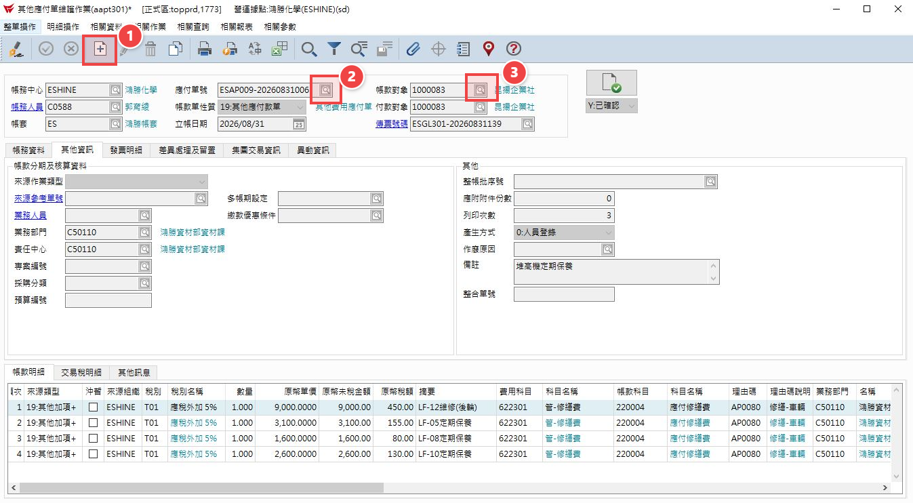
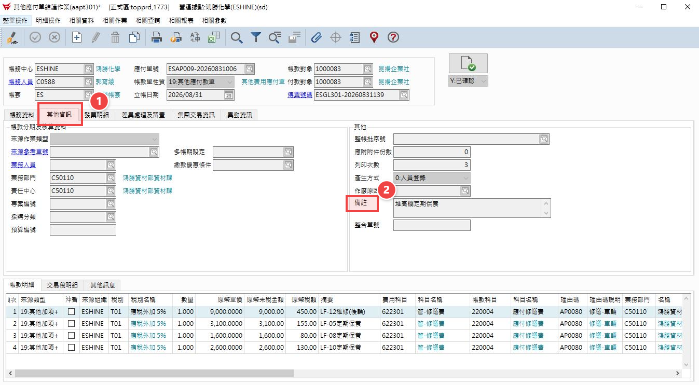
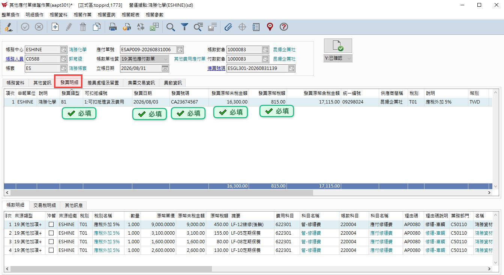
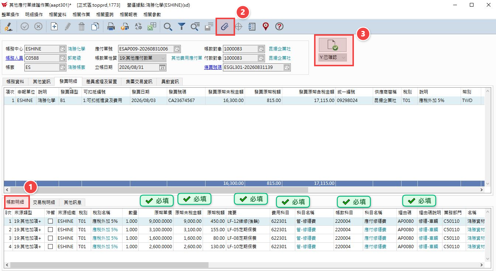
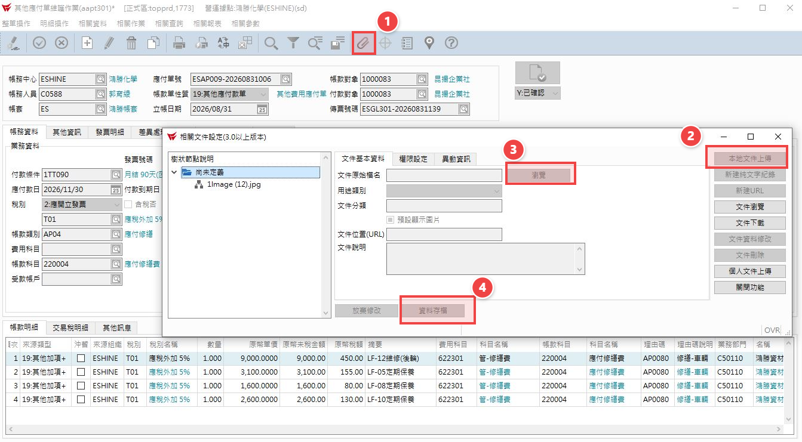

# 16.其他應付單維護

## 第 1 頁

16.其他應付單維護
簡報大綱與核心內容整理

請款項目:板架租賃、調撥運費、改櫃及吊櫃及堆高機保養費等

## 第 2 頁

步驟 1

收到廠商請款明細核對無誤後，請廠商開立發票並收到請款資料後就可登打系統。

倉儲系統方案比較簡報 | Page 2

## 第 3 頁

步驟 2

單頭部份 1.按+新增  2.下拉式選AP009其他應付款單 3.帳款對象按下拉式選單去選廠商

倉儲系統方案比較簡報 | Page 3

## 第 4 頁

步驟 3

單中 1.先其他資訊填上備註

倉儲系統方案比較簡報 | Page 4

## 第 5 頁

步驟 4

單中2 選發票明細 依序填入打勾部份

倉儲系統方案比較簡報 | Page 5

## 第 6 頁

步驟 5

單身下 帳款明細 填寫打勾處完後，再按迴紋針附上廠商MAIL給我們的發票+明細。最後按綠色打勾。

倉儲系統方案比較簡報 | Page 6

## 第 7 頁

步驟 6

附上廠商請款明細及發票，等BPM送簽完即可列印紙本給會計。

倉儲系統方案比較簡報 | Page 7

