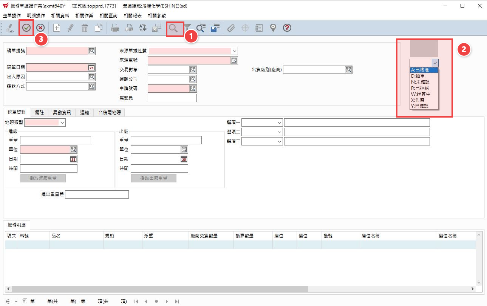
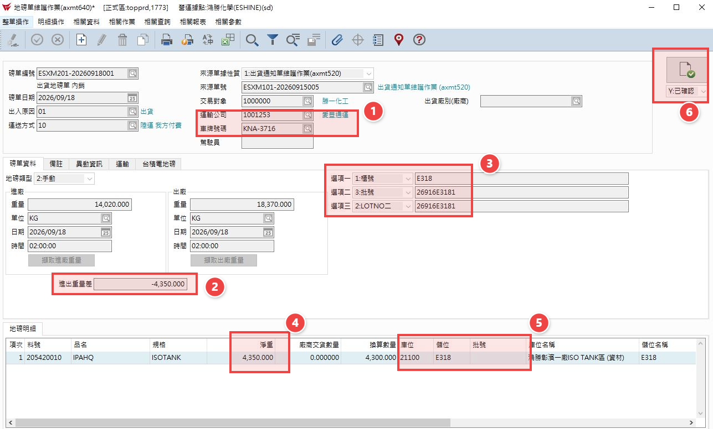
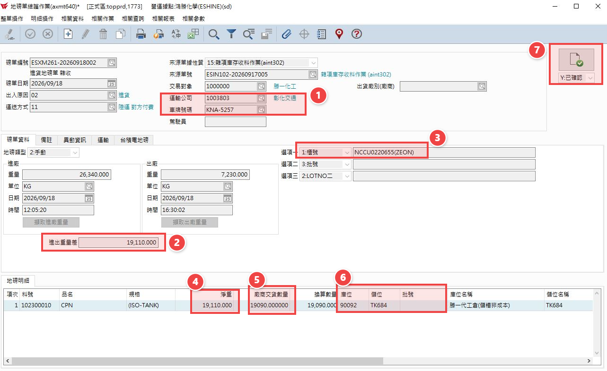

# 2.地磅單維護

## 第 1 頁

2.地磅單維護 簡報大綱與核心內容整理

主要在地磅登打完成後做檢核動作，檢核完資料都登打正確後按確認即磅單成立。

## 第 2 頁

步驟 1

•	按放大鏡 再按下拉式選單 選"未確認" 依進出貨內容檢查，檢查無誤後再按綠色打勾鍵即核單完成。

倉儲系統方案比較簡報 | Page 2

## 第 3 頁

步驟 2

2.出貨磅單查核項目如下圖，如果是包材類出貨，要再注意批號是否有帶入，最後再按確認。

倉儲系統方案比較簡報 | Page 3

## 第 4 頁

步驟 3

3.進貨磅單查核項目如下圖，進貨磅單要再注意 廠商交貨數量 是否有打上，最後再按確認。

倉儲系統方案比較簡報 | Page 4

