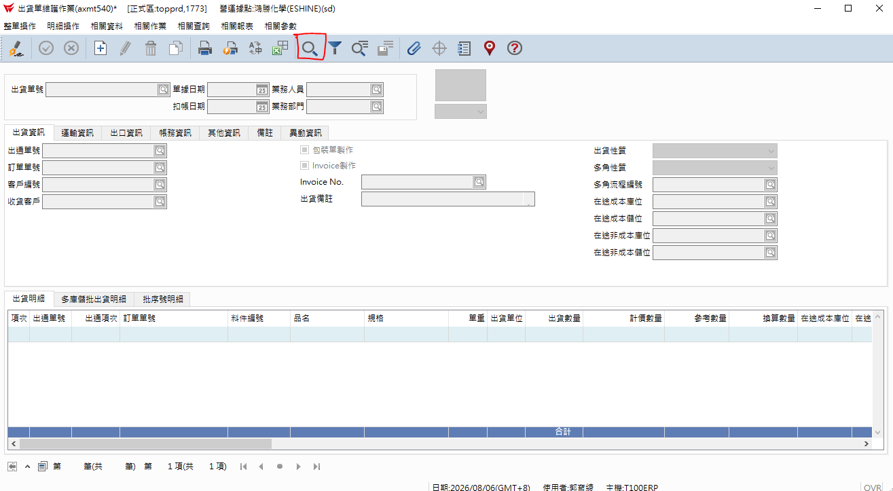
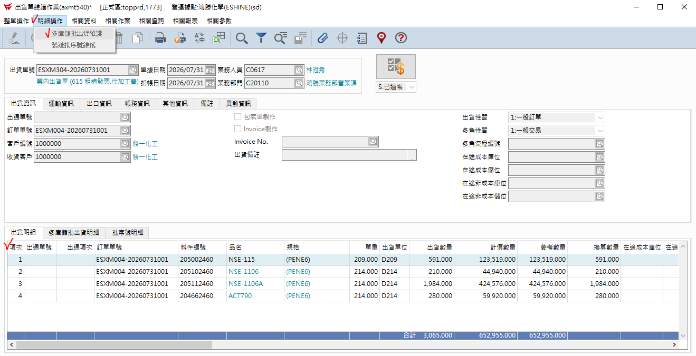
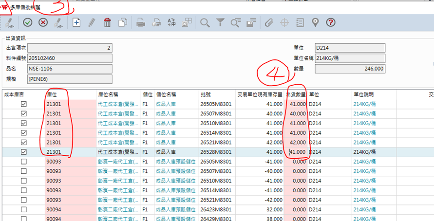
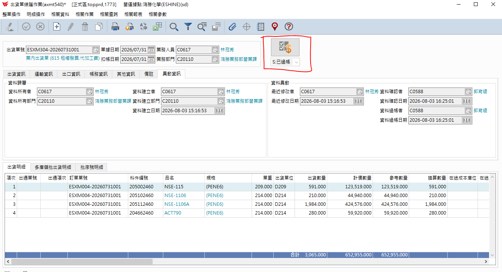

# 3.出貨單維護

## 第 1 頁

3.出貨單維護
簡報大綱與核心內容整理

此份出貨單維護作業此次只針對N系列部份做範例(每月月底待業助提供出貨單單號後再進行下面步驟)

## 第 2 頁

步驟 1

•	按放大鏡→輸入業助提供的出貨單號進行維護作業

倉儲系統方案比較簡報 | Page 2

## 第 3 頁

步驟 2

2.分別在單身的項次依序 點 明細操作 多庫儲批出貨維護

倉儲系統方案比較簡報 | Page 3

## 第 4 頁

步驟 3

3.進入多庫批維護 在單身庫位21301 依交易單位現有庫存量的數量填入 出貨數量。

倉儲系統方案比較簡報 | Page 4

## 第 5 頁

步驟 4

4.最後按過帳即完成

倉儲系統方案比較簡報 | Page 5

