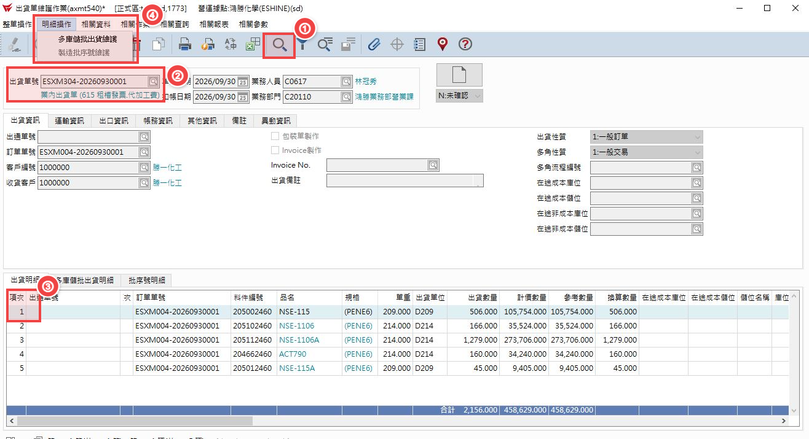
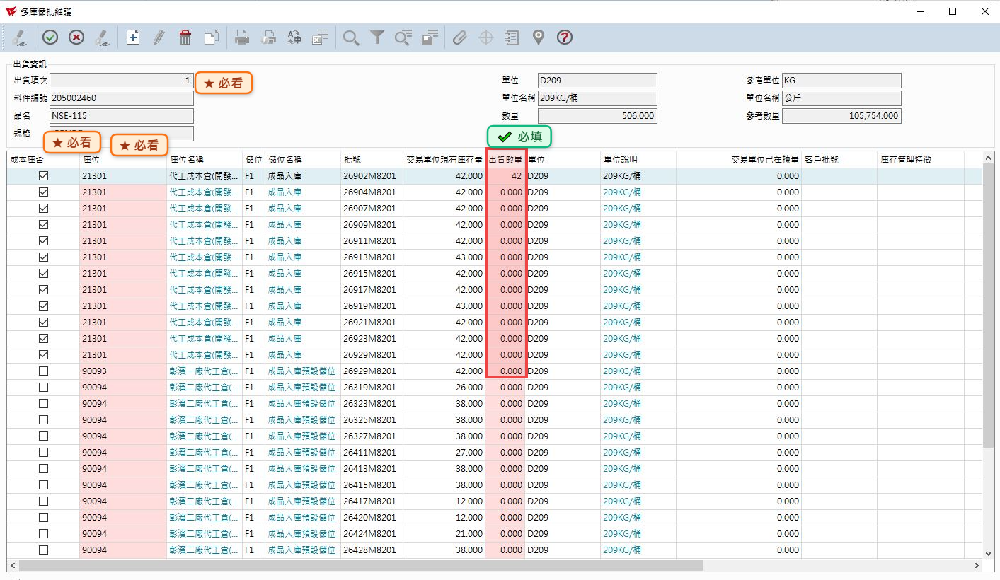
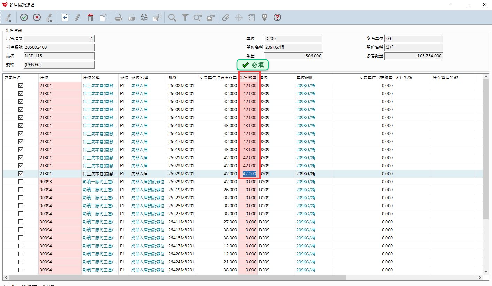
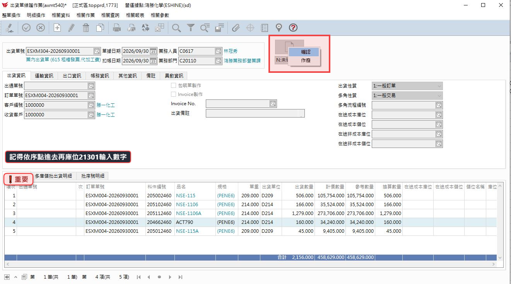

# 3.出貨單維護

## 第 1 頁

3.出貨單維護
簡報大綱與核心內容整理

此份出貨單維護作業此次只針對N系列部份做範例(每月月底待營業課人員提供出貨單單號後再進行下面步驟)

## 第 2 頁

步驟 1

•	營業課人員提供出貨單號給資材做維護並過帳。1.按放大鏡。 2.輸入提供單號。 3.再將滑鼠放在項次1。 4.最後再點多庫儲批出貨維護。

倉儲系統方案比較簡報 | Page 2

## 第 3 頁

步驟 2

2.點「多庫儲批出貨維護」會出現新視窗來做維護

倉儲系統方案比較簡報 | Page 3

## 第 4 頁

步驟 3

3.進入多庫批維護 在單身庫位21301 依交易單位現有庫存量的數量填入 出貨數量。
  填完一個項次後再點第二個項次如步驟1所示重覆做法

倉儲系統方案比較簡報 | Page 4

## 第 5 頁

步驟 4

4.等依序填完數字後 最後按確認過帳即完成

倉儲系統方案比較簡報 | Page 5

