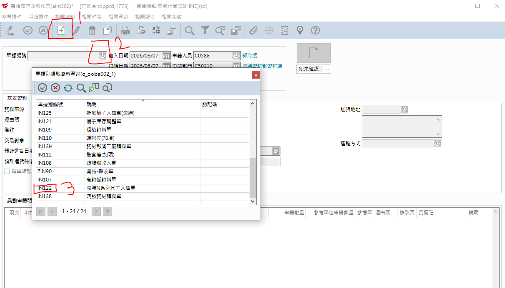
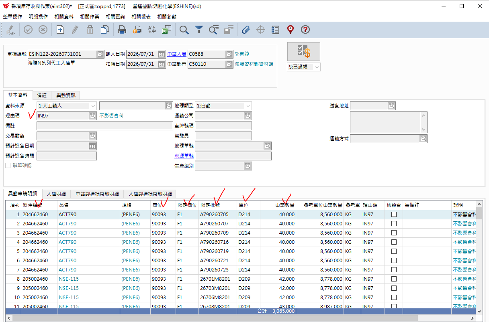

# 4.雜項庫存收料

## 第 1 頁

4.雜項庫存收料
簡報大綱與核心內容整理

此份用月底N系列之調整庫位作範例

## 第 2 頁

步驟 1

目的，延續N系列的出貨單維護完成後，再進行用雜收方式將當月庫位21301的N系列直接調整到庫位90093。

倉儲系統方案比較簡報 | Page 2

## 第 3 頁

步驟 2

•	按 + 新增 ，再接下拉式選擇單據別編號

倉儲系統方案比較簡報 | Page 3

## 第 4 頁

步驟 3

2.依數量打入單身部份，如下圖打勾處KEY入。

倉儲系統方案比較簡報 | Page 4

