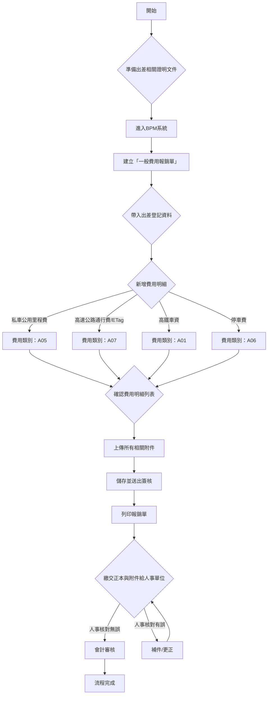

好的，這是一份為基層員工設計的 BPM 一般費用報銷單（私車公用）操作流程教學教材。

---

# 🚗 BPM 一般費用報銷單：私車公用與出差交通費用申請指南

本教材旨在協助您了解如何透過 BPM 系統申請國內出差時，使用自用車所產生的里程費、通行費及其他相關交通費用報銷。

**重要提醒：** 實際系統下拉選項、費用標準與簽核路徑，請以公司當期系統設定及財務規範為準。若有疑問，請洽人事或會計單位。

---

## 💡 教材核心重點 (Key Takeaways)

1.  **線上申請與紙本繳交並行**：完成 BPM 線上費用申請後，務必將**原始憑證**及**所有佐證資料正本**，依規定時間與方式交給人事單位，人事核對無誤後才會轉交會計審核。
2.  **分項清楚，不混淆費用類別**：私車公用里程費、通行費/ETag、高鐵車資、停車費等不同性質的費用，**必須分開**新增明細項目，避免合併填寫。
3.  **證明文件齊全且相符**：所有申請項目都需要相對應的證明文件（如出差登記、路線截圖、ETag明細、高鐵票、停車發票等）。線上上傳的附件與紙本繳交的正本必須一致。

---

## 🖼️ 系統流程圖

---

## 📖 步驟解析

### 一、進入 BPM 一般費用報銷單

1.  透過 BPM 左側選單進入「一般費用報銷單」。
    *   **小撇步：** 若您是從「流程處理頁」進入，請先點選「EPM」，再找到「一般費用報銷單」即可。

    BPM一般費用報銷單_私車公用操作流程_img_1

2.  建立新單後，請先完成「表頭資料」的填寫，再進入「費用明細」頁籤。

### 二、帶入出差登記資料

1.  在「費用明細區」中找到「出差登記單號」欄位，點選旁邊的 **查詢按鈕**。
2.  在彈出的「資料選取器」視窗中，透過出差登記單號、日期、出差地點或出差原因進行核對，並選擇您要報銷的出差登記資料。
3.  選取後回到表單，請確認「出差類別」、「開始/結束日期與時間」、「出差地點」、「出差原因」及「備註」等欄位資訊是否正確無誤。

    

### 三、新增私車公用費用明細 (A05)

如果您的出差行程使用個人自用車，請按照以下步驟新增里程費明細：

1.  在「費用明細」頁籤下，點選「新增」按鈕。
2.  「費用類別」請選擇 **A05「國內出差－交通－私車公用」**。
3.  依序填寫以下欄位資料：

    *   **憑證日期：** 填寫出差的日期。
    *   **報銷金額：** 填寫私車公用計算出的里程費金額。
    *   **費用說明：** 建議填寫「私車公用（車號）」或「出差目的」。
    *   **費用地區、稅別** 等請依實際狀況及公司規定選填。

    

4.  填妥後點選「新增」按鈕，將資料寫入下方的費用明細列表。
5.  請檢查列表中的「費用類別」、「憑證日期」、「金額」、「費用地區」、「稅別」與「費用說明」是否正確。

    

### 四、新增高速公路通行費與 ETag 費用明細 (A07)

若本次出差行程有高速公路通行費或 ETag 扣款，請務必與私車公用里程費**分開新增明細**：

1.  在「費用明細」頁籤下，點選「新增」按鈕。
2.  「費用類別」請選擇 **A07「國內出差－交通－ETag／通行費」**。
3.  依序填寫以下欄位資料：

    *   **憑證日期：** 填寫通行或扣款日期。
    *   **報銷金額：** 填寫實際支付的通行費金額。
    *   **費用說明：** 建議填寫「ETag（日期／路段）」或「通行費（日期／路段）」。
    *   **發票類型、發票號碼** 等請依實際狀況及公司規定選填。

    

4.  **證明文件：** ETag 明細建議依扣款紀錄逐筆或依公司允許的彙總方式填寫，並將可辨識日期、路段/里程與金額的明細（例如遠通電收扣款明細）一併上傳作為佐證。

    

### 五、里程與費用計算核對

在提交報銷前，請務必核對您所填寫的私車公用里程與費用計算是否正確，並準備好相關佐證截圖。

### 六、新增其他出差交通費用 (非私車公用)

若您的出差行程還包含其他交通費用（例如高鐵、停車費），請依照以下指引分開新增明細。這些費用與 A05 私車公用里程費是不同性質的費用。

#### 6.1 高鐵車資 (A01)

1.  在「費用明細」頁籤點選「新增」。
2.  「費用類別」選擇 **A01「國內出差－交通－高鐵」**。
3.  **憑證日期：** 填寫高鐵票或電子發票日期。
4.  **報銷金額：** 填寫實際支付金額。
5.  **發票類型、稅別碼、發票號碼與原幣稅額：** 依票據資料填寫。
6.  **費用說明：** 建議填寫「高鐵（起訖站／出差事由）」。
7.  請保留完整高鐵票或電子發票憑證。

    

#### 6.2 停車費 (A06)

1.  在「費用明細」頁籤點選「新增」。
2.  「費用類別」選擇 **A06「國內出差－交通－停車費」**。
3.  **憑證日期：** 填寫停車發票或收據日期。
4.  **報銷金額：** 填寫實際支付金額。
5.  **發票類型、稅別碼、發票號碼與未稅/稅額/含稅金額：** 依發票內容登錄。
6.  **費用說明：** 建議填寫「停車費（停車地點／對應出差行程）」。

    

### 七、完成明細、上傳附件並送出簽核

在提交報銷單前，請仔細進行以下檢查：

1.  **核對明細總金額：** 確認費用明細列表中的每一筆資料均已新增，且合計金額與表頭的「本幣報銷總金額」一致。

    

2.  **確認費用說明：** 每筆明細的「費用說明」應清楚可辨識用途，例如「私車公用（車號）去程」、「ETag（日期）國道一號」、「高鐵（台北-台中）會議」。
3.  **上傳附件：** 上傳本次申請的所有相關附件證明，例如：
    *   出差登記核准單
    *   私車公用：去程／回程路線截圖（顯示里程數）
    *   高速公路通行費：ETag／通行費明細（顯示日期、路段、金額）
    *   高鐵車資：高鐵票或電子發票截圖
    *   停車費：停車發票或收據截圖
    *   其他必要佐證文件。
4.  **儲存與送出：** 先點選「儲存」，確認系統沒有任何必填欄位或金額檢核訊息後，再點選「送出／發起流程」。
5.  **確認簽核流程：** 送出後請記錄下報銷單號，並至「流程處理」或「待辦區」確認已產生簽核流程。

### 八、紙本繳交與後續審核

BPM 線上流程完成並送出後，您的報銷流程尚未結束！

1.  **繳交正本：** 您必須將所有**原始憑證**及**必要佐證資料正本**，依照人事單位指定的方式及期限，親自或郵寄交付給人事單位。
    *   **交件提醒：** 請務必確保線上填報的資料與紙本正本文件一致。
2.  **人事核對：** 人事單位會核對您提交的紙本資料與線上申請內容。
    3.  **若核對無誤：** 人事單位將轉交給會計單位進行最終審核與撥款。
    4.  **若核對有誤：** 人事單位會通知您進行補件或更正，待完成後才會重新轉交會計審核。

---

**備註：** 本流程依提供的 BPM 畫面與附件示例整理；實際欄位名稱、代碼、費用標準、附件要求及簽核層級，仍以公司最新公告與系統設定為準。