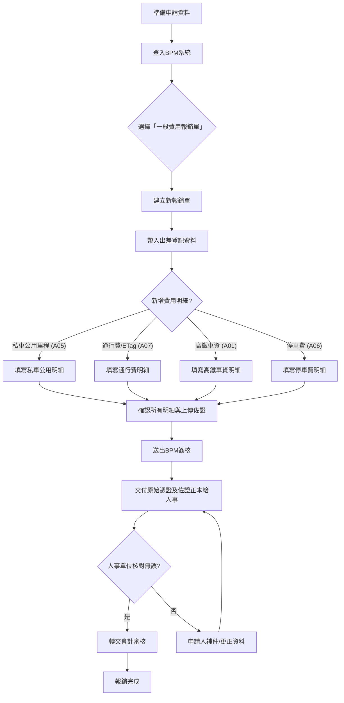

這是一份為基層員工設計的 BPM 一般費用報銷單操作教學，特別針對「私車公用」及其他交通費用的申請流程。請仔細閱讀，以便您能快速、正確地完成報銷作業。

---

# BPM 一般費用報銷單：私車公用與出差交通費用報銷指南

這份指南將帶您了解如何在 BPM 系統中，申請國內出差時使用個人車輛所產生的里程費、通行費，以及其他常見的出差交通費用（如高鐵、停車費）的報銷流程。

請注意：實際下拉選項、費用標準與簽核路徑，請以公司當期系統設定及財務規範為準。

---

## 💡 教材核心重點 (Key Takeaways)

1.  **費用分開申請，明細清楚：** 私車公用里程費、高速公路通行費、高鐵車資、停車費等不同性質的費用，都必須在 BPM「一般費用報銷單」中**分開新增明細**。
2.  **佐證資料務必齊全：** 報銷時務必帶入「出差登記單號」，並上傳私車公用的里程路線截圖、通行費或 ETag 明細、高鐵票/停車收據等必要佐證。
3.  **線上申請，線下繳交：** BPM 系統送出簽核後，**記得將所有原始憑證和佐證資料的「正本」交給人事單位核對**，核對無誤後才會轉交會計審核。

---

## 🖼️ 系統流程圖

---

## 📖 步驟解析

### 一、 開始報銷流程前的準備

在進入系統報銷前，請先備妥以下資料：

1.  **出差登記單號：** 已在 BPM 完成的出差登記單號。
2.  **私車公用里程計算資料：** 包含去程與回程的路線截圖，顯示清晰的里程數。
3.  **ETag / 通行費明細：** 高速公路過路費的扣款紀錄。
4.  **高鐵票或電子發票：** 若有搭乘高鐵。
5.  **停車費發票或收據：** 若有產生停車費用。
6.  **其他必要佐證資料。**

### 二、 進入 BPM 一般費用報銷單

1.  從 BPM 左側選單進入「一般費用報銷單」。若從流程處理頁進入，請先選擇 `EPM`，再點選「一般費用報銷單」。

    
    *圖 1：由流程處理頁進入 EPM 的一般費用報銷單*

2.  **建立新單後，請先完成表頭資料的填寫**，再進入費用明細的編輯。

### 三、 帶入出差登記資料

1.  在費用明細區的「**出差登記單號**」欄位，點選查詢按鈕 `[...]`。
2.  在跳出的「資料選取器」中，利用出差登記單號、日期、出差地點或出差原因核對資料，並選擇正確的出差登記。
3.  回報銷單後，請確認「出差類別」、「開始／結束日期與時間」、「出差地點」、「出差原因」及「備註」等欄位是否均已正確帶入。

    
    *圖 2：出差登記單號資料選取與帶入欄位*

### 四、 新增費用明細

在費用明細頁籤，針對每一筆費用點選「新增」，並依序填寫相關欄位。**請注意，不同性質的費用應分開新增明細。**

#### 1. 私車公用里程費 (費用類別：A05)

1.  在費用明細頁籤按「**新增**」。
2.  「費用類別」請選擇 **`A05 國內出差－交通－私車公用`**。
3.  依照指示填妥各欄位，例如憑證日期、金額、費用地區、稅別與費用說明等。

    
    *圖 3：A05 私車公用費用明細欄位*

4.  填妥後按「**新增**」將資料寫入下方明細表。新增後請再次核對費用類別、憑證日期、金額、費用地區、稅別與費用說明是否正確。

    
    *圖 4：私車公用明細新增後的列表檢查*

#### 2. 高速公路通行費與 ETag (費用類別：A07)

1.  若本次行程有高速公路通行費或 ETag 扣款，請點選「新增」。
2.  「費用類別」請選擇 **`A07 國內出差－交通－ETag`** 或其他適用的通行費類別。
3.  **重要：** 通行費應與私車公用里程費**分開新增明細**，避免將不同性質費用合併在同一筆。
4.  ETag 明細建議依扣款紀錄逐筆或依公司允許的彙總方式填寫，並將可辨識日期、路段／里程與金額的明細一併上傳。

    
    *圖 5：A07 ETag 費用明細欄位示例*

    
    *圖 6：ETag 通行費明細紀錄示例*

#### 3. 里程與費用計算核對

請務必核對您提交的里程數與費用計算是否正確，並準備好去程與回程的路線截圖作為佐證。

*圖 7：去程路線與里程示例*

*圖 8：回程路線與里程示例*

#### 4. 其他交通費用 (非私車公用)

以下兩項為一般出差交通費，與私車公用里程費不同。申請時應依實際發生的交通工具或停車支出選擇費用類別，並檢附相對應的票據或明細。

**a. 高鐵車資 (費用類別：A01)**

1.  在費用明細按「新增」，「費用類別」選擇 **`A01 國內出差－交通－高鐵`**。
2.  「憑證日期」填高鐵票或電子發票日期；「報銷金額」填實際支付金額。
3.  依票據資料填寫「發票類型」、「稅別碼」、「發票號碼」與「原幣稅額」；若為公司規範的可核銷票據，應保留完整憑證。
4.  「費用說明」建議填寫「高鐵（起訖站／出差事由）」；「費用地區」依公司設定選取。

    
    *圖 10：A01 高鐵費用明細示例*

**b. 停車費 (費用類別：A06)**

1.  在費用明細按「新增」，「費用類別」選擇 **`A06 國內出差－交通－停車費`**。
2.  「憑證日期」填停車發票或收據日期；「報銷金額」填實際支付金額。
3.  填寫「發票類型」、「稅別碼」、「發票號碼」與「未稅／稅額／含稅金額」；若停車場開立統一發票，請依發票內容登錄。
4.  「費用說明」填「停車費」，並建議補充停車地點或對應出差行程。**請注意：** 停車費雖然可能與自用車行程同時發生，但此筆申請本身是停車費，不屬於私車公用里程費。

    
    *圖 11：A06 停車費明細示例*

### 五、 完成報銷單與送出簽核

1.  **檢查費用明細與總金額：** 確認費用明細列表中每一筆資料均已新增，且合計金額與表頭「本幣報銷總金額」一致。
2.  **填寫費用說明：** 確認每筆明細的「費用說明」可以清楚辨識用途，例如車號、去程／回程路線或 ETag 扣款日期等。

    
    *圖 9：多筆費用明細完成後的列表檢查*

3.  **上傳必要佐證資料：** 務必上傳出差登記、去程／回程路線截圖、ETag／通行費明細及其他所有必要佐證。
4.  **儲存與送出流程：**
    *   先按「**儲存**」，確認系統沒有必填欄位或金額檢核訊息。
    *   確認無誤後，再按「**送出**」或「**發起流程**」。
    *   送出後，請**記錄報銷單號**，並至「流程處理」或「待辦區」確認已產生簽核流程。

### 六、 紙本憑證繳交與後續審核

BPM 線上流程完成後，報銷作業並未結束！您仍須辦理紙本正本與相關資料的交件。

1.  **繳交原始憑證正本：** 申請人應將所有原始憑證（如高鐵票根、停車費發票/收據等）及必要佐證資料（如自行列印的里程路線圖、ETag 明細等）的**正本**，交給**人事單位**。
2.  **人事與會計審核：** 人事單位收到資料後會進行核對。若核對無誤，才會轉交會計進行審核。若人事單位發現資料不一致或不齊全，您需要先完成補件或更正，才能繼續後續的審核流程。

---

**重要提醒：**

本流程說明依提供的 BPM 畫面與附件示例整理；實際欄位名稱、代碼、費用標準、附件要求及簽核層級，仍以公司最新公告與系統設定為準。如有疑問，請洽詢人事或財務部門。