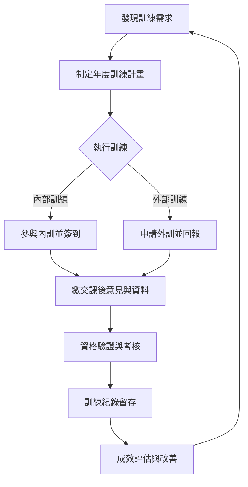

這是一份為基層員工設計的教育訓練教材，旨在幫助您了解公司教育訓練的目標、流程與您的角色。

---

# C10200-EDU-01 教育訓練作業管理辦法：員工必讀重點

## 💡 教材核心重點 (Key Takeaways)

1.  **能力到位最重要**：訓練的目標是「讓你的能力真正到位」，而不僅是上完課。你的學習成果會被驗證並記錄，這對公司營運品質、效率、環境、安全衛生都至關重要。
2.  **完整流程要遵守**：從需求評估、課程安排、實際參與、資格驗證到成效追蹤，公司有一套完整的訓練流程。身為員工，務必配合各項申請、簽到、回報與考核程序，這是確保訓練有效的關鍵。
3.  **訓練與發展息息相關**：透過教育訓練，你將提升專業技能、符合法規要求，並有機會優化個人績效考核與職涯發展。積極參與並配合，是讓自己與公司共同成長的機會。

---

## 🖼️ 系統流程圖

以下是公司教育訓練的主要流程，幫助您了解整個環節：

---

## 📖 步驟解析

### 一、訓練是什麼？為什麼要做？

這份教育訓練作業管理辦法，核心目標是確保每一位員工「**能力有沒有真的到位**」。訓練不只是一堂課，而是一個完整的循環，從發現您的能力需求、安排執行、到最後驗證您的資格與學習成效。

*   **管理目的**：讓您了解公司理念、目標與作業流程，並具備本職所需的專業知識與技能。
*   **最終目標**：提升公司在**品質、效率、環境、安全衛生**各方面的表現。
*   **適用對象**：全公司所有從業人員，涵蓋職前訓練與在職訓練。
*   **實施方式**：包含內部訓練、外部訓練、證照取得、資格驗證，並將所有紀錄留存在系統中。

### 二、訓練的五大管理主線

每一堂訓練都必須遵循以下五個管理步驟，確保訓練的有效性：

1.  **找需求**：根據公司的策略、關鍵績效指標(KPI)或您的職能差距，來發現需要加強的訓練項目。
2.  **排計畫**：從需求調查開始，總務課會彙整並制定年度教育訓練計畫。
3.  **做訓練**：實際進行內部訓練、外部訓練，或在您職位變更、新進時的職前訓練。
4.  **驗資格**：透過測驗、實際操作、取得證照等方式，驗證您是否確實學會並具備所需能力。
5.  **留證據**：將您的訓練履歷、簽到紀錄、心得報告、成效評估等資料，完整地留在公司的系統（如ERP）中。

**請注意**：訓練完成不等於「上完課」！必須能證明您「**受過訓練、能力通過驗證、且紀錄可供查詢**」。

### 三、誰負責什麼？

為了確保訓練順利進行，總務課與各單位有明確的分工：

*   **總務課負責**：
    *   制定與修訂公司的教育訓練制度。
    *   彙總全公司的年度訓練計畫，並評估整體成效。
    *   督導各單位訓練的實施情況。
    *   辦理專業管理類課程及外派研習。
    *   安排新進人員的職前訓練與維護訓練場所。
*   **各單位負責**：
    *   擬定單位內的訓練計畫。
    *   辦理單位內部（管理或技術性）訓練。
    *   負責單位內新進人員的訓練及彙總實施情況。

### 四、訓練計畫與證照管理

訓練計畫的制定與證照的管理，是確保訓練符合公司營運和法規要求的基礎。

#### 4.1 訓練需求評估

*   **各單位**：會根據您的「工作敘述表」、年度目標與KPI，評估您可能存在的職能差距，並提報訓練需求。
*   **總務課**：每年年底會調查這些需求，彙整並制定公司的《年度教育訓練計畫表》。

#### 4.2 法規證照管理分類

公司會將您取得的法規證照進行分類管理：

*   **【A類】**：需向主管機關報備，或用於內部診斷的重要證照（如特定操作證照）。
*   **【B類】**：不須向主管機關報備，但需存放在公司備查的證照。
*   **【C類】**：公司內部程序書或指導書中規定需具備的證照。

**安全衛生回訓規定**：
*   一般人員：每年需回訓 3 小時。
*   特殊作業人員（如電焊、缺氧）：每年需額外增列 3 小時回訓。

### 五、講師與教材

優質的講師和教材是訓練成功的關鍵。

#### 5.1 內部講師資格

*   需由組長級以上人員，或擔任相關職務滿 3 年者擔任。
*   必須受過相關訓練或具備合格證書。
*   經理、副理級主管則為當然的內部講師。

#### 5.2 外部講師資格

*   通常會邀請機關團體的專業人士或企業管理顧問擔任。

#### 5.3 教材編選與存查

*   **內訓教材**：由內部講師編撰，或沿用公司已有的存檔教材。
*   **外訓教材**：參加外部訓練的員工，需提供訓練教材供公司傳閱或列入圖書備查。

### 六、如何執行教育訓練

無論是內部訓練或外部訓練，都有其標準的執行程序，請您務必遵守。

#### 6.1 內部訓練執行

*   **課前**：
    *   如果您將要變更工作，需先接受相關的安全衛生訓練。
    *   請填寫《教育訓練紀錄表》與《教育訓練報名表》。
*   **課中**：
    *   務必在《課程簽到表》上簽名，這是您參與訓練的重要證明。
*   **課後**：
    *   請填寫《課後意見調查表》並送交總務課。
    *   您的受訓資料將會鍵入公司的 ERP 系統，更新您的個人訓練履歷。

#### 6.2 外部訓練執行

*   **申請**：
    *   在申請外訓前，請先到 QRisk 系統查詢是否有相關需求。
    *   在 ERP 系統中填寫《外派訓練申請單》。
*   **結訓後**：
    *   結訓後 10 日內，您必須上系統填寫《心得報告》，分享您的學習成果。
*   **證照處理**：
    *   若獲得法規特定證照，請將證照正本送交管理部留存，並登錄到 QRisk 系統中。
*   **費用與加班**：
    *   如果外部訓練在非上班日進行，您可以依規定申請加班。
    *   即使是免費的訓練，也必須依照程序填寫申請表。

### 七、訓練的考核與稽核

訓練成果將被考核，並納入您的個人績效。公司也會定期進行稽核，確保訓練管理機制的有效運作。

#### 7.1 訓練考核方式

您的訓練成效會透過以下方式進行考核：

*   口試、筆試
*   技能實作測驗
*   學前/學後測驗比較
*   教育訓練考核成績將會列入您的「個人年度績效考核」。

#### 7.2 特定資格驗證

針對一些特殊職位，會有額外的資格驗證要求：

*   **校正人員**：需受過儀器校驗訓練並考試合格。
*   **檢驗人員**：需經品管主管實施程序書訓練，並實作合格。

#### 7.3 費用與稽核

*   **內部講師鐘點費**：內部講師的鐘點費為每小時 200 元（由總務課填寫申請單）。
*   **稽核**：公司每年至少會執行一次內部診斷，並將教育訓練的實施情況與成效納入管理審查報告。

---