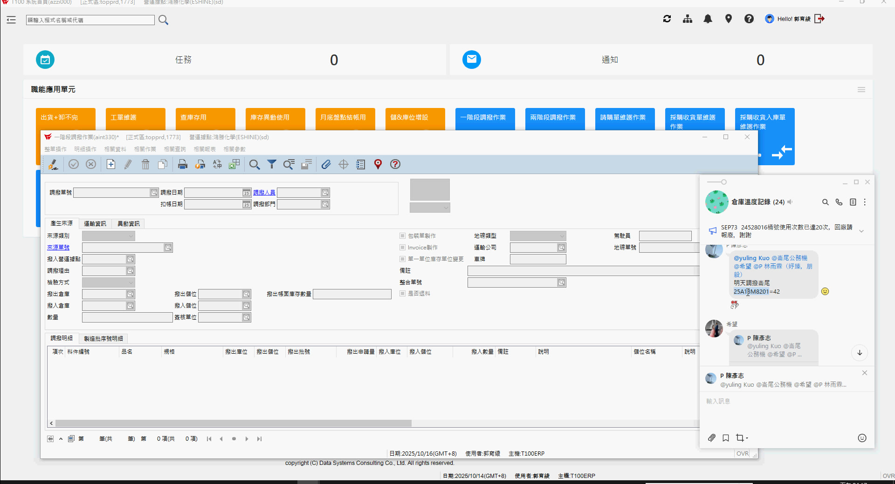
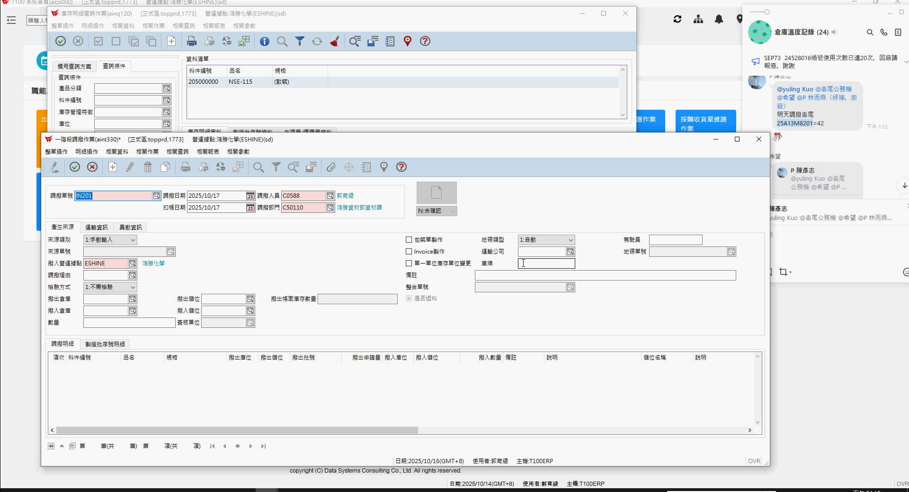
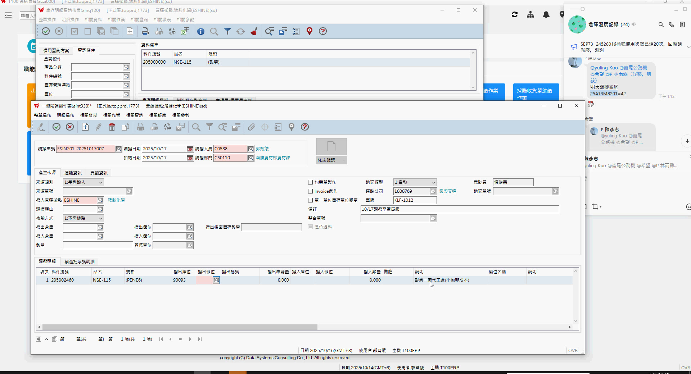
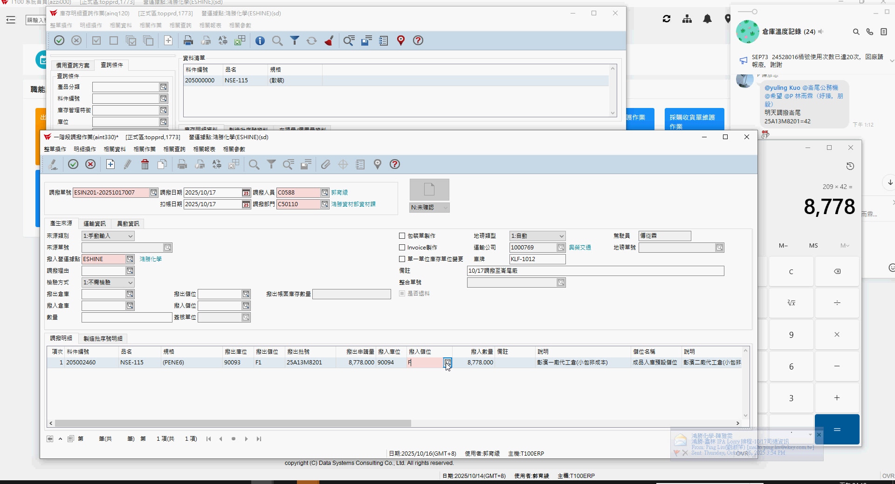
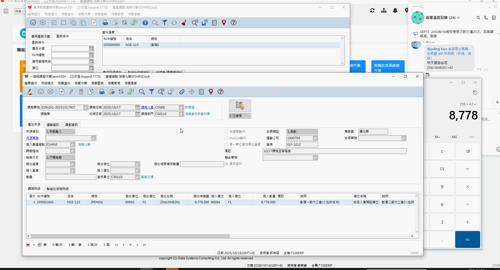

# 🎥 T100-N系列廠間調撥操作 (影片SOP教學)

這是一份關於 T100-N 系列廠間調撥操作的教學教材，旨在協助您快速理解並正確執行系統操作。

---

## 💡 教材核心重點 (Key Takeaways)

1.  **資訊先行，確認批號與庫存**: 在建立調撥單前，務必先透過 LINE 訊息取得確切的「批號」，並利用「庫存明細查詢作業」確認該批號的庫存狀況與相關資料（如料號、規格），確保後續調撥的準確性。
2.  **調撥單關鍵欄位填寫**: 建立調撥單時，請務必正確填寫「調撥日期」（如為次日調撥請調整日期）、選擇「調撥單號 (來源)」為 IN201，並詳細輸入「車牌號碼」與「備註」以利追溯與溝通。
3.  **明細資料的精確輸入**: 在新增明細項目時，除了填寫正確的「料號」（如 M82-115）與選取對應的「規格」（如 PN PE60）外，**數量需精確計算** (例如影片中透過計算機確認數量)，並填寫正確的「儲位」、「桶位」、「入儲位」和「入桶位」以確保庫存流轉的正確性。

---

## 🖼️ 系統流程圖

```mermaid
graph TD
    A[開始] --> B{檢查LINE訊息取得批號};
    B --> C[點擊「一階段調撥作業」];
    C --> D[點擊「庫存查詢」];
    D --> E[點擊「庫存明細查詢作業」];
    E -- 輸入批號查詢 --> F[確認批號對應料號及規格];
    F --> G[重新開啟「一階段調撥作業」];
    G --> H[點擊「新增」按鈕];
    H --> I[設定「調撥日期」為次日];
    I --> J[選擇「調撥單號 (來源)」為 IN201];
    J --> K[輸入「車牌號碼」及「備註」];
    K --> L[點擊「+」新增明細項目];
    L --> M[查詢並選取正確的「料號」及「規格」];
    M --> N[輸入「儲位」、「桶位」];
    N --> O[計算並輸入「數量」];
    O --> P[輸入「入儲位」、「入桶位」];
    P --> Q[點擊「存檔」];
    Q --> R[點擊「稽核」];
    R --> S[點擊「列印」並預覽];
    S --> T[完成];
```

---

## 📖 步驟解析

1.  **查看 LINE 訊息並開啟調撥作業**
    *   收到 LINE 訊息通知有調撥需求與相關批號資訊。
    *   點擊主畫面中的「一階段調撥作業」圖示。
    

2.  **查詢批號庫存明細**
    *   關閉「一階段調撥作業」視窗。
    *   點擊「庫存查詢」資料夾圖示。
    *   在展開的子選單中，點擊「庫存明細查詢作業」圖示。
    
    *   在開啟的「庫存明細查詢作業 (ITG)」視窗中：
        *   將 LINE 訊息中的批號（例如：230302008980）貼到「批號」欄位。
        *   勾選「批號」旁的核取方塊。
        *   點擊「查詢」按鈕（放大鏡圖示）。
    *   系統將顯示該批號的庫存明細，確認料號（例如：M82-115）及相關資訊。
    
    *   確認資訊無誤後，關閉「庫存明細查詢作業」視窗。

3.  **新增一階段調撥單**
    *   重新開啟「一階段調撥作業 (ITN)」視窗。
    *   點擊工具列上的「新增」按鈕（白色文件圖示旁的「+」）。
    *   將「調撥日期」調整為預計調撥的日期（例如：2023/05/17）。
    *   點擊「調撥單號 (來源)」欄位旁的「放大鏡」圖示，選擇「IN201 調撥單」。
    *   在「車牌號碼」欄位輸入「PLA-0R12」。
    *   在「備註」欄位輸入「10月17日 調撥至 蘆竹廠」。

4.  **填寫調撥明細**
    *   在視窗下方明細區塊，點擊「新增」按鈕（綠色「+」圖示）。
    *   在彈出的「調撥物品 (ITN_01_01)」視窗中：
        *   在「料號」欄位輸入「M82-115」。
        *   勾選「料號」旁的核取方塊。
        *   點擊「查詢」按鈕（放大鏡圖示）。
        *   從查詢結果中，選擇符合的料號（例如：顯示規格為 PN PE60 的項目）。
    
    *   將「儲位」填寫為「900931」。
    *   將「桶位」填寫為「F1」。
    *   使用計算機計算調撥數量（例如：209 * 42 = 8778）。
    *   將計算出的「數量」填寫為「8778」。
    *   將「入儲位」填寫為「900934」。
    *   將「入桶位」填寫為「F2」。
    *   確認「廠別」與「入廠別」為正確的廠區及倉儲位置。
    *   點擊「確定」按鈕儲存明細。

5.  **儲存、稽核與列印調撥單**
    *   在「一階段調撥作業」主視窗中，點擊工具列上的「存檔」按鈕（磁碟片圖示）。
    *   點擊彈出確認視窗中的「確定」。
    *   點擊工具列上的「稽核」按鈕（鉛筆圖示）。
    *   點擊彈出確認視窗中的「確認」。
    *   點擊工具列上的「列印」按鈕（印表機圖示）。
    *   在彈出的「列印」選單中，點擊「預覽」按鈕。
    
    *   預覽調撥單，確認所有資訊正確無誤。
    *   關閉預覽視窗。
    *   （可選擇將調撥單截圖並傳送至 LINE 或其他通訊軟體）。
    *   完成調撥單的建立與列印流程。