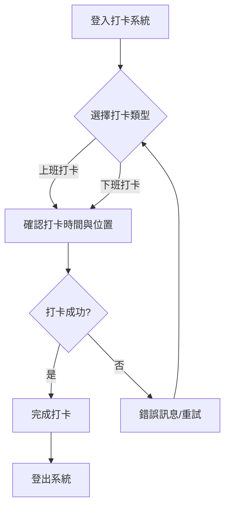

您好！

感謝您的委託。我已仔細閱讀您的要求。

然而，我發現您提供的原始內容是：
```
# test.pdf (系統自動轉換)
```
這表示實際的文字內容是**空白的**，沒有可以讓我「萃取、重新排版並提煉精華」的原始資訊。

在沒有實際內容的情況下，我無法產出具有實質意義的教學教材，也無法從中提煉核心重點、繪製流程圖，或保留並安插原文中的圖片標籤（因為沒有提供）。

**為了展示我理解您的需求並能產出符合格式的教材，我將提供一份以「如何使用新的線上打卡系統」為主題的** **示範教材範本**。這份範本將嚴格遵守您要求的格式，包含核心重點、流程圖和步驟解析，並安善置入**示意用的圖片標籤**。

請您在日後提供實際的原始文件內容，我將非常樂意為您撰寫精確且高品質的教材。

---

## 📖 **【員工打卡系統操作指南】**

### 💡 教材核心重點 (Key Takeaways)

1.  **操作簡便，快速完成**：新的線上打卡系統設計直觀，旨在簡化您的每日打卡流程，只需幾個簡單步驟即可完成。
2.  **確保準確，保護權益**：請務必在規定的時間內，按照正確步驟完成打卡，以確保您的出勤記錄準確無誤，維護個人權益。
3.  **異常處理，即時回報**：若在打卡過程中遇到任何系統問題或操作困難，請立即向您的主管或人資部門反應，以便及時處理。

### 🖼️ 系統流程圖



### 📖 步驟解析

本指南將帶您快速了解如何使用新的線上打卡系統完成每日的上下班打卡。

#### **步驟一：登入打卡系統**

1.  開啟您的電腦或行動裝置上的瀏覽器。
2.  在網址列輸入公司提供的打卡系統網址（例如：`portal.yourcompany.com/punch`）。
3.  輸入您的員工編號和密碼，然後點擊「登入」按鈕。
    
    *   **提示**：首次登入可能需要設定或更改密碼。若忘記密碼，請點擊「忘記密碼」連結進行重設，或聯繫人資部門協助。

#### **步驟二：選擇打卡類型**

1.  成功登入後，您會看到系統主頁面。頁面上通常會顯示「上班打卡」和「下班打卡」兩個選項。
2.  根據您當前的需求，點擊對應的按鈕。
    *   **上班時**：請點擊「上班打卡」。
    *   **下班時**：請點擊「下班打卡」。
    

#### **步驟三：確認打卡資訊**

1.  點擊打卡按鈕後，系統會自動擷取您當前的打卡時間和地點資訊。
2.  請仔細核對畫面上顯示的**時間**是否為目前時間，以及**地點**是否正確（例如，顯示為公司地點）。
3.  確認無誤後，點擊「確認打卡」或「送出」按鈕。
    
    *   **注意**：部分系統可能需要您授權使用地理位置服務，請務必允許，以便系統記錄正確的打卡地點。

#### **步驟四：完成打卡並登出**

1.  當您點擊「確認打卡」後，系統會顯示「打卡成功！」的訊息，同時顯示您的打卡紀錄詳情。
2.  請確認這條成功訊息，確保您的打卡確實被系統記錄。
3.  完成打卡後，為了您的帳戶安全，建議點擊右上角的「登出」按鈕，安全退出系統。
    
    *   **重要**：若系統顯示「打卡失敗」或任何錯誤訊息，請勿自行重試多次。請截圖錯誤訊息，並立即聯繫您的主管或人資部門尋求協助。

---